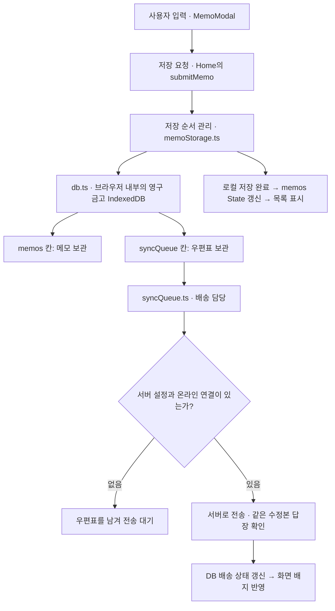

# MemoOrbit 초보자 학습 가이드

메모 한 장을 쓰고, 다시 찾고, 우주 지도에서 여는 여행을 따라가 봅시다. 함수를 외우기보다 **내 행동이 어떤 데이터를 바꾸고, 그 데이터가 어디로 가는지** 이해하는 것이 목표입니다. 이 문서는 기존의 긴 기술 설명 대신 처음 읽는 안내서입니다. 자세한 계산과 전체 파일 해설은 필요해졌을 때 찾아보면 됩니다.

## 1. MemoOrbit의 전체 작동 그림 (3분 요약)

### 사용자가 메모를 쓰고 저장 버튼을 눌렀을 때

1. 작성 창이 글·서식·태그를 한 묶음으로 포장합니다.
2. 메인 화면이 그 묶음에 메모 번호와 수정 시간을 붙이고 기기에 저장을 요청합니다.
3. 브라우저 안에 메모와 서버로 보낼 우편표를 함께 보관합니다. 로컬 저장이 끝나면 목록에 반영하고 작성 창을 닫습니다.
4. 서버가 연결되어 있다면 배송 담당이 나중에 전송합니다. 확인 답장이 와야 배송 완료 표시로 바뀝니다.

그림을 한 줄로 읽으면 **UI 입력 → Local DB 저장 → Sync Queue 서버 배송**입니다. 화면을 다시 그리는 길과 서버로 보내는 길이 로컬 저장 뒤에 갈라집니다.

| 코드에서 만나는 이름 | 머릿속에 그릴 물건 | 실제 역할 |
| --- | --- | --- |
| State | 지금 책상 위에 펼친 메모 목록 | React가 화면을 그릴 때 사용하는 현재 값 |
| IndexedDB | 브라우저 내부의 영구 금고 | 새로고침 뒤에도 메모와 배송 대기 작업을 보관 |
| syncQueue.ts | 서버 배송 전용 우체통 및 우편표를 관리하는 배송 담당 | DB에 이미 들어 있는 우편표를 읽어 전송·재시도 |
| useVisualViewport | 실시간 돋보기 측정기 | 키보드 때문에 줄어든, 실제 보이는 화면 높이 측정 |
| Canvas | 픽셀 전용 고속 도화지 | 좌표에 맞춰 메모 점과 연결선을 반복해서 그림 |

여기서 ‘영구’는 새로고침 후에도 남는다는 뜻입니다. 브라우저 데이터 삭제까지 막거나 다른 기기에 자동 복사해 주는 금고는 아닙니다. **현재 저장소에는 메모 동기화 서버 구현이 없습니다.** 서버 주소 설정이 없으면 `pending`을 유지합니다. AI 분석 API가 있다는 사실도 메모가 서버에 영구 저장되었다는 뜻은 아닙니다.

### 처음에는 핵심 파일 6개만 펼치세요

프로젝트 전체 파일 구성을 확인했습니다. `app/`은 화면 진입점과 API, `src/components/`는 화면 부품, `src/hooks/`는 화면 동작 도우미, `src/lib/`는 저장·검색·계산, `src/utils/`는 보조 가공, `src/data/`는 기본 메모, `types/`는 데이터 모양을 담당합니다. `public/`은 그림, `tests/`는 동작 검사, 루트 설정과 문서 및 `docs/`는 실행·학습을 돕습니다.

모든 파일을 차례로 읽을 필요는 없습니다. 다음 여섯 곳을 학습의 정류장으로 삼으세요.

| 순서 | 필수 파일 | 처음 찾을 이름과 질문 |
| --- | --- | --- |
| 1 | [app/page.tsx](app/page.tsx) | `Home`, `submitMemo`, `memos`: 저장 요청을 누가 받아 목록으로 만들까? |
| 2 | [MemoModal.tsx](src/components/MemoModal.tsx) | `saveCurrentMemo`, `plainText`, `editorRef`: 입력한 글을 어떻게 포장할까? |
| 3 | [db.ts](src/lib/storage/db.ts) | `replaceAllMemos`: 메모와 우편표를 어디에 함께 넣을까? |
| 4 | [syncQueue.ts](src/lib/syncQueue.ts) | `startSyncQueue`, `settleSyncEntry`: 배송과 답장을 어떻게 처리할까? |
| 5 | [useVisualViewport.ts](src/hooks/useVisualViewport.ts) | `viewport`, `measure`: 키보드가 올라오면 어떤 값이 달라질까? |
| 6 | [OrbitGraphView.tsx](src/components/OrbitGraphView.tsx) | `layoutRef`, `selectedId`: 메모가 어떻게 점과 미리보기로 바뀔까? |

아래에 등장하는 다른 파일은 정류장 사이의 연결 도우미입니다. 처음에는 설명만 읽어도 충분합니다.

## 2. 1단계: 작성한 메모의 여행 (데이터 저장 & 동기화)

### 사용자가 ‘주말 산책’ 메모를 쓰고 저장할 때

1. 첫 줄에 ‘주말 산책’, 다음 줄에 ‘공원에서 사진 찍기’를 씁니다.
2. 저장을 누르면 작성 창이 첫 줄을 제목, 나머지를 본문으로 묶습니다.
3. 기기 금고에 메모와 배송 우편표를 함께 넣습니다.
4. 목록에 메모가 나타납니다. 서버 배송 여부는 별도 배지로 확인합니다.

이제 실제 이름을 붙여 따라가 봅시다.

**1단계 — 작성 창에서 포장하기.** `MemoModal`의 입력 이벤트는 `plainText`를 갱신합니다. 굵은 글씨 같은 실제 편집 내용은 `editorRef.current`가 가리키는 브라우저 편집 영역에도 있습니다. `editorRef`는 종이 자체가 아니라 “지금 쓰고 있는 종이가 놓인 자리”를 가리키는 표지판입니다. 저장 버튼은 `submit`을 거쳐 `saveCurrentMemo`를 호출합니다. 이 함수가 편집 영역에서 최신 글과 HTML 서식을 읽고 태그·이미지와 함께 `MemoDraft`라는 초안 꾸러미를 만들어 `onSubmit`으로 부모에게 전달합니다.

**2단계 — 접수대에서 번호 붙이기.** `app/page.tsx`의 `Home`이 넘겨준 `onSubmit`은 `submitMemo`로 연결됩니다. `submitMemo`는 새 메모에 `id`와 `createdAt`을 붙이고, 수정한 메모라면 기존 번호를 유지합니다. `updatedAt`은 새로 기록하고 `syncStatus`는 `pending`으로 준비합니다. `isSavingMemo`는 접수 중 표시판이라서 중복 저장을 막습니다.

**3단계 — 금고에 넣을 순서 정하기.** [memoStorage.ts](src/lib/memoStorage.ts)의 `persistMemos`는 저장 요청을 `writeQueue`에 줄 세웁니다. 앞선 저장이 끝난 뒤 다음 저장을 시작하는 대기줄입니다. 이 대기줄은 브라우저 금고에 남는 서버 전송 큐와는 별개입니다. 내부에서 `db.ts`의 `replaceAllMemos`를 호출합니다. 이 화면의 주된 저장 경로는 `saveMemo` 직접 호출이 아닙니다.

**4단계 — 메모와 우편표를 한 봉투로 확정하기.** `replaceAllMemos`는 기존 DB 목록과 새 목록을 비교합니다. 바뀐 메모는 `memos` 칸에, 배송할 최신 수정본은 `syncQueue` 칸에 기록합니다. 둘을 하나의 트랜잭션으로 확정합니다. ‘메모를 넣었는데 우편표는 빠진’ 반쪽 접수가 생기지 않도록 한 묶음으로 처리하는 것입니다. `syncRevision`과 우편표의 `revision`은 이번 수정본에 붙인 접수 번호입니다.

**5단계 — 목록 보여 주기.** `submitMemo`는 `await persistMemos(...)`로 로컬 기록이 끝나기를 기다린 다음 `setMemos`로 새 배열을 전달하고 작성 창을 닫습니다. React는 바뀐 `memos`를 바탕으로 화면을 다시 그립니다. 서버 답장까지 기다리지는 않습니다. 고정·삭제처럼 `memos`를 먼저 바꾸는 다른 동작은 `Home`의 저장 이펙트가 감지해 같은 `persistMemos`로 연결합니다.

**6단계 — 배송하고 배지 바꾸기.** `persistMemos`의 저장 알림을 받은 `startSyncQueue`가 실행됩니다. 전송기가 설정되어 있고 온라인일 때 `drainSyncQueue`가 우편표를 한 건씩 보냅니다. `settleSyncEntry`는 같은 수정본의 성공 답장인지 확인하여 우편표를 지우고 `synced`를 기록합니다. `onChange`로 DB 목록을 받은 `Home`은 내용이 일치하는 메모의 배지만 `setMemos`로 합칩니다.

### 사용자가 인터넷이 끊긴 상태에서 저장하고 다시 연결했을 때

1. 로컬 금고에는 먼저 저장할 수 있습니다.
2. 우편표는 DB에 남으므로 새로고침해도 배송 할 일이 사라지지 않습니다.
3. 앱 시작·온라인 재연결·새 저장 알림·5초 주기 확인이 배송 담당을 깨웁니다. 서버 설정이 있어야 실제 전송합니다.
4. 전송 실패는 `failed`로 표시하고 재시도 시간을 늦춥니다. 대기 확인이 5초마다 있어도 실패한 모든 항목을 매번 즉시 보내는 것은 아닙니다.

옛 편지의 답장이 늦게 도착하는 상황도 생각해 보세요. ‘산책’을 저장한 뒤 ‘비가 오면 독서’로 고쳤다면 두 수정본의 접수 번호가 다릅니다. 예전 답장으로 새 우편표를 지우지 않도록 `revision`을 비교합니다.

금고 저장에 문제가 생기면 `persistMemos`는 LocalStorage에 비상 백업을 시도합니다. 이것까지 실패하면 작성 창을 유지하고 오류를 알립니다. 다음 시작의 `hydrateMemoStorage`는 비상 백업을 우선 복구하고, 필요한 경우 예전 LocalStorage 메모를 옮겨 `memos`에 불러옵니다.

**자동 저장의 정확한 뜻:** 모달의 닫기 동작은 `closeEditor → saveCurrentMemo → submitMemo`를 사용합니다. 매 글자 입력마다 DB에 저장하는 기능이나 브라우저 강제 종료 시 저장 보장을 뜻하지 않습니다. 현재는 공백 외 글자가 있어야 저장하므로 글자 없이 표·이미지만 있는 초안은 이 조건을 통과하지 않습니다.

## 3. 2단계: 모바일 키보드와의 밀당 (에디터 & UI)

### 사용자가 휴대폰에서 본문을 눌러 키보드를 열었을 때

1. 키보드가 올라오면서 실제 보이는 화면이 작아집니다.
2. 실시간 돋보기 측정기가 남은 높이를 잽니다.
3. 작성 창이 그 높이에 맞춰 내부 편집 공간을 줄입니다.
4. 헤더와 도구는 자리를 유지하고 가운데 본문을 스크롤하며 씁니다.

`MemoModal`은 `useVisualViewport(isOpen)`을 호출합니다. 이 훅 안의 `measure`가 `window.visualViewport.height`를 읽어 `setViewport`에 전달하면, 반환된 `viewport.height`가 모달의 CSS 변수와 내부 높이로 이어집니다. 책상 위에 키보드 상자가 올라왔을 때 남은 종이 공간을 자로 재는 모습입니다.

이 측정기는 **보이는 높이**를 알려 줍니다. 키보드가 열렸는지 직접 판정하거나 서식 시트를 여는 역할까지 맡지는 않습니다. 첫 측정 전에는 CSS 높이를 쓰고, API가 없으면 `innerHeight`를 사용합니다.

현재 훅은 크기 변경인 `resize`를 구독하며 `scroll`은 구독하지 않습니다. 본문을 밀 때마다 책상 위치까지 옮기면 화면이 떨릴 수 있기 때문입니다. `offsetTop`도 0을 유지합니다. 모달이 닫히면 측정 예약과 이벤트 구독을 정리합니다.

### 사용자가 단어를 선택하고 ‘가가’를 눌렀을 때

1. 서식을 바꿀 글자 범위를 책갈피처럼 보관합니다.
2. 입력 포커스를 해제해 키보드가 내려가도록 합니다.
3. 화면 높이가 돌아오고 안정되면 서식 시트를 보여 줍니다.
4. 굵게 등을 누르면 보관한 범위에 적용합니다. 본문을 다시 누르면 시트를 닫고 편집을 재개합니다.

여기서는 연결 도우미 [useKeyboardFormatSheet.ts](src/hooks/useKeyboardFormatSheet.ts)가 신호등 역할을 합니다. `formatSheet.mode`는 `editor`(글쓰기) → `waiting`(키보드 내려가는 중) → `format`(서식 선택)으로 바뀝니다. `MemoModal`은 대기·서식 모드에서 본문을 읽기 상태로 두고, 선택 범위를 이용해 키보드를 다시 열지 않고 서식을 적용합니다. 중간에 본문으로 돌아가면 예약을 취소하여 시트가 뒤늦게 나타나지 않게 합니다.

돋보기 측정값이나 태그가 바뀐다고 작성 중인 종이를 통째로 새 종이로 바꾸면 커서와 선택 위치가 사라집니다. 그래서 초기 HTML은 한 번 넣고, 편집 영역 자체와 `plainText` 같은 화면 상태의 역할을 나눕니다. 실제 iPhone 키보드 애니메이션과 터치 감각은 아직 실기기 검수가 필요한 항목입니다.

## 4. 3단계: 우주처럼 떠다니는 메모들 (2D Physics & 검색)

### 사용자가 검색어와 태그를 고르고 태그 궤도로 이동했을 때

1. 검색창이 입력을 받은 뒤 잠깐 기다려 검색 조건을 부모에게 전달합니다.
2. 전체 메모 중 조건에 맞는 메모만 골라 새 목록을 만듭니다.
3. 궤도 화면은 그 목록을 점으로 만들고, 저장된 연관 정보를 보고 자리를 잡습니다.
4. 도화지에 점과 선을 그립니다. 점을 누르면 해당 메모의 미리보기를 볼 수 있습니다.

**1단계 — 입장 조건 만들기.** 검색창의 입력은 `SearchFilterBar`의 로컬 상태에 먼저 들어갑니다. 마지막 입력 후 300ms가 지나면 `Home`의 `filterOptions`로 전달됩니다. 안내원이 한 글자마다 입장 명단을 다시 쓰지 않고 말이 잠깐 끝나기를 기다리는 모습입니다. 상세 필터는 즉시 적용합니다.

**2단계 — 입장할 메모 고르기.** 연결 도우미 [filterMemos.ts](src/lib/filterMemos.ts)의 `filterMemos(memos, filterOptions)`가 `filteredMemos`를 만듭니다. 검색어·태그·사진·표·고정 여부·기간 조건을 검사하며, 원본 `memos`는 지우거나 바꾸지 않습니다. 여행과 독서 태그를 고르면 둘 중 하나가 있는 메모가 태그 관문을 통과합니다. 사진 조건까지 켰다면 사진 관문도 통과해야 합니다.

기간은 `createdAt`으로 검사합니다. 일반 정렬은 고정 메모 우선, 그다음 `updatedAt` 최신순입니다. AI 검색에서는 양수의 관련 점수를 가진 메모도 포함하고 점수를 먼저 비교하지만 다른 필터는 그대로 지킵니다. AI 호출은 이 함수 밖에서 수행하며 실패해도 문자열 검색을 유지합니다.

**3단계 — 같은 명단 전달하기.** `Home`은 카드 목록과 `OrbitGraphView`에 같은 `filteredMemos`를 전달합니다. 필터로 점이 사라져도 금고에서 삭제된 것은 아닙니다. 궤도에서는 목록 정렬 순서대로 점을 줄 세우지 않고 별도의 좌표를 계산합니다. 현재 점 하나는 태그 하나가 아니라 **메모 한 개**입니다.

**4단계 — 자리 배치하기.** `OrbitGraphView`는 [orbitClustering.ts](src/lib/orbitClustering.ts)의 `createOrbitLayout`으로 시작 위치를 만들고 `stepOrbitLayout`으로 조금씩 움직입니다. `Memo.links`의 `targetId`는 상대 메모 번호, `weight`는 가까운 정도입니다. 강한 연결은 고무줄처럼 적당한 간격으로 모으고, 점들이 겹치면 서로 밀어냅니다. 0.75 이상 연결은 같은 무리로 묶습니다. 분석하지 않은 메모 사이에 가짜 점수를 만들지는 않습니다.

계산된 위치는 `layoutRef`에 둡니다. `requestAnimationFrame`은 다음 그림을 그릴 시간에 계산을 한 번 진행하도록 예약합니다. 현재 구현은 최대 180단계를 진행한 뒤 반복을 멈추고, 이동·확대·크기 변경 등이 생기면 다시 그립니다. 무한히 움직이는 실제 우주를 계산하는 것은 아닙니다.

**5단계 — 도화지에 그리기.** [orbitCanvas.ts](src/lib/orbitCanvas.ts)의 `drawOrbitCanvas`가 위치를 받아 Canvas라는 픽셀 전용 고속 도화지에 점·빛·궤도선을 그립니다. 강한 연결부터 점당 최대 네 개의 선을 표시해 너무 복잡해지지 않게 합니다. `transformRef`는 도화지를 어느 방향으로 얼마나 옮기고 확대해서 볼지 기억합니다. 확대는 메모 본문이나 DB를 수정하지 않습니다.

**6단계 — 점에서 메모로 돌아오기.** 점을 선택하면 `selectedId`가 바뀌고, 그 번호로 찾은 `selectedMemo`가 미리보기에 표시됩니다. 열기 동작은 부모의 `onOpenMemo`로 이어져 다시 작성 창으로 돌아갑니다. 빠르게 바뀌는 좌표는 Ref에, 화면 부품을 바꿔야 하는 선택 번호는 State에 두는 구분이 보입니다.

AI 연결이 필요한 경우에는 `onLinksAnalyzed`를 통해 `Home`의 `applyAnalyzedLinks`로 결과를 전달합니다. `memos`에 연결 정보를 반영하면 저장 이펙트가 이를 DB에도 기록합니다. AI 분석에 실패하면 저장된 연결을 유지하고 안내를 표시합니다. 도화지가 직접 서버 분석이나 메모 저장까지 하는 것은 아닙니다.

## 5. 초보자를 위한 코드 읽기 팁

### 사용자가 ‘저장했는데 어디에 들어갔지?’라고 궁금해졌을 때

1. 버튼의 `onClick`이나 폼의 `onSubmit`에서 출발합니다.
2. 연결된 함수가 만든 데이터의 이름을 찾습니다.
3. `set...`과 DB 기록 함수를 찾아 바뀌는 위치를 표시합니다.
4. 그 값을 읽는 화면이나 다음 함수를 찾습니다.

이번 여행에서는 `saveCurrentMemo → submitMemo → persistMemos → replaceAllMemos → setMemos`를 먼저 따라가면 됩니다. 그다음 서버 배송 길을 따로 따라가세요.

| 읽다가 만나는 표시 | 쉬운 질문 | 이 프로젝트의 예 |
| --- | --- | --- |
| `onSubmit`, `onClick`, `onInput` | 어떤 행동이 출발점이지? | 저장 버튼과 본문 입력 |
| `setMemos`, `setPlainText`, `setSelectedId` | 화면에 쓰는 어떤 값이 바뀌지? | 목록·입력 텍스트·선택 메모 |
| `await persistMemos`, `transaction.done` | 무엇이 끝나기를 기다리지? | 서버 배송 전 로컬 기록 확정 |
| `put`, `delete` | 금고의 어느 칸을 바꾸지? | 메모와 우편표 기록·삭제 |
| `useEffect` | 어떤 값이 바뀌면 뒤따라 일하지? | `memos` 변경 후 저장 |
| `ref.current` | 화면 밖 작업 메모나 실제 요소를 가리키나? | 편집 영역·선택 범위·점 좌표 |

State는 책상 위의 현재 목록, DB는 금고라고 생각하세요. `setMemos`만 호출했다고 금고에 저절로 들어가는 것은 아닙니다. 둘을 이어 주는 저장 호출 또는 이펙트를 반드시 찾아야 합니다. Ref도 값을 바꾼 것만으로 React 화면이 자동 갱신되지는 않습니다. 캔버스는 그 뒤의 다시 그리기 호출까지 확인하세요.

`filter`는 조건에 맞는 메모를 고르는 체, `map`은 각 메모를 새 모양으로 옮겨 담는 작업입니다. 원본 배열을 직접 바꾸지 않고 새 배열을 전달하면 이전 목록과 다음 목록의 경계가 분명해집니다. `reduce`, 삼각함수, 힘 계산식에서 막히면 먼저 건너뛰어도 됩니다. 입력이 무엇이고 결과를 어디에 쓰는지 한 문장만 적어 두세요.

읽기 연습으로 ‘태그를 고르니 점이 줄었다’를 설명해 보세요. **선택 조건 변경 → `filterOptions` → `filteredMemos` → `OrbitGraphView` 재배치**라고 말할 수 있다면 계산식을 몰라도 전체 흐름을 이해한 것입니다. 여기에는 DB 삭제가 없습니다.

다음 학습이 필요할 때는 [프로젝트 구조 설명](PROJECT_STRUCTURE.md)에서 수정할 위치를 찾고, [전체 코드베이스 학습 가이드](FULL_CODEBASE_LEARNING_GUIDE.md)에서 정밀 해설을 확인하세요. 구현 완료·미완료 범위는 [PRD](PRD.md)를 기준으로 보되, 오래된 명세보다 최신 개정과 실제 코드를 함께 확인하세요.
