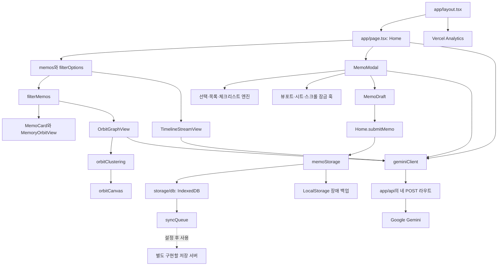
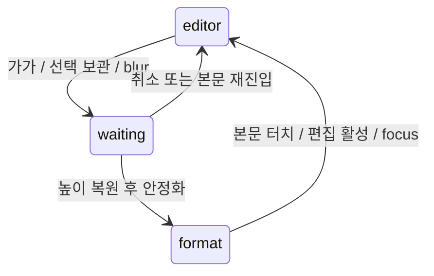

# MemoOrbit 전체 코드베이스 학습 및 모듈별 리뷰 가이드

분석 기준: 2026-09-10, 문서 작성 직전 커밋 `71e0dbf`의 실행 코드.

이 문서는 파일을 찾는 지도이면서, 작은 코드 조각을 읽고 실행 흐름을 설명하는 학습 교재다. [PROJECT_STRUCTURE.md](PROJECT_STRUCTURE.md)는 빠른 구조 확인용, 이 문서는 원리·경계 사례·학습 과제까지 살펴보는 정밀 리뷰용이다. 요구사항은 [PRD.md](PRD.md), 작업 규칙은 [AGENTS.md](AGENTS.md)에 있다.

## 0. 분석 범위와 실제 구현 확인

현재 프로젝트에는 **Zustand 의존성이나 Store 구현이 없다.** 원본 메모 배열은 `app/page.tsx`의 `Home`이 `useState`로 보관하고, Props와 콜백으로 하위 컴포넌트와 연결한다. 따라서 이 문서의 상태 파이프라인은 실제 `setMemos` 호출을 추적한다.

`src/components/memo/CreateMemoModal.tsx`도 존재하지 않는다. 요청하신 작성 모달은 **`src/components/MemoModal.tsx`의 `MemoModal`**에 해당한다. Layer 2에서 이 파일을 초기화·상태·이펙트·이벤트·JSX로 나누어 설명한다.

버전 관리 대상의 소스, 페이지, API, 설정, 테스트, 문서와 정적 자산을 모두 다룬다. 설치 패키지·빌드 결과·Git 내부 파일은 생성물로 구분하며 내부 파일을 하나씩 분석하지 않는다. 비밀 환경변수 값은 읽거나 수록하지 않는다. 코드 조각은 명시된 원본 구간의 발췌이므로 독립 실행 예제가 아니다. 줄 번호는 분석 시점 기준이며 이후 변경되면 함수명으로 다시 찾는다.

각 코드 블록 위 링크는 원본 파일과 줄 번호를 가리킨다.

### 파일을 읽는 네 가지 질문

1. **왜 존재하는가?** 화면, 계산, 저장, 전송 중 맡은 책임을 찾는다.
2. **무엇을 받는가?** Props, 사용자 이벤트, DOM, 환경설정, 서버 응답을 구분한다.
3. **무엇이 바뀌는가?** React State, Ref, DOM, IndexedDB, 네트워크는 서로 다른 변경 대상이다.
4. **언제 정리하는가?** 이벤트 구독, 타이머, 비동기 요청, 팝업 잠금의 종료 지점을 찾는다.

## 1. 전체 모듈 맵



화살표는 주요 사용·데이터 전달 관계다. `MemoDraft → Home`은 자식에서 부모로 콜백을 호출하는 흐름이다. 저장 서버는 구현된 노드와 구별해 점선으로 표시했다. Gemini 분석 서버와 원격 메모 저장 서버는 같은 기능이 아니다.

### 디렉터리별 책임

| 위치 | 내용 | 상태의 소유권 |
| --- | --- | --- |
| `app/` | 루트 레이아웃, 단일 Home 페이지, 전역 CSS | Home이 원본 메모·메뉴·검색 조건 소유 |
| `app/api/` | Gemini 분석 요청 4개 | 요청 단위 서버 계산, 메모 영구 저장 없음 |
| `src/components/` | 13개 화면·입력·표시 컴포넌트 | UI별 State, 부모 데이터를 Props로 소비 |
| `src/hooks/` | 가시 높이·서식 시트·문서 스크롤 잠금 | 브라우저 수명과 UI 상태 연결 |
| `src/lib/` | 검색·편집·AI·저장·물리 계산 | 함수별 DOM 또는 저장소 변경, 일부 순수 계산 |
| `src/utils/` | 대표 사진·날짜 그룹·PNG 출력 | 계산 결과 또는 다운로드 부수 효과 |
| `src/data/`, `src/types/`, `types/` | 목업과 공통 계약 | 런타임 데이터 또는 타입 선언 |
| `tests/` | 4개 테스트 파일 | 격리된 가상 DOM·DB·전송기 |
| `public/` | PNG 10개와 SVG 5개 | 정적 자산, React 상태 없음 |

## 2. 세 레이어 학습 커리큘럼

| 차시 | 읽는 순서 | 학습 목표 | 이해 여부를 확인할 질문 |
| --- | --- | --- | --- |
| Layer 1-1 | package → tsconfig → layout → memo 타입 | 실행 환경과 데이터 계약 파악 | `@/types/memo`는 어느 폴더인가? |
| Layer 1-2 | Home 초기화 → memoStorage → storage/db | 메모 로딩과 로컬 기록 추적 | 전체 삭제 후 목업이 다시 생기지 않는 이유는? |
| Layer 1-3 | Home 저장 → syncQueue → 서버 계약 | 저장 완료와 전송 완료 구분 | 왜 인터넷 연결만으로 synced가 되지 않는가? |
| Layer 2-1 | MemoModal Props → Ref·State → mountEditor | 편집 DOM 소유권 이해 | 태그를 눌러도 HTML이 다시 주입되지 않는 이유는? |
| Layer 2-2 | selection → 서식 → 목록·체크리스트 | Range와 이벤트 순서 이해 | 버튼의 pointerdown과 click을 왜 나누는가? |
| Layer 2-3 | viewport → sheet → scroll lock → JSX | 모바일 높이와 스크롤 분리 | 툴바에 bottom 값을 직접 계산하는가? |
| Layer 2-4 | 표·첨부·태그 → 카드·날짜 UI | 입력 모듈의 경계 사례 파악 | 표 아래 CSS 여백만으로 입력 줄이 생기는가? |
| Layer 3-1 | SearchFilterBar → Home 점수 → filterMemos | 검색·정렬 파이프라인 이해 | 선택 태그 OR와 조건 간 AND는 어디에 있는가? |
| Layer 3-2 | geminiClient → 4개 API → 시간 분석 | 서버 계약과 실패 처리 이해 | AI 분석 실패 시 어떤 화면 값이 유지되는가? |
| Layer 3-3 | OrbitGraphView → clustering → canvas | 물리 좌표와 화면 좌표 구분 | 배지 갱신이 물리 계산을 재시작시키는가? |
| Layer 3-4 | Analytics → 테스트 → 정적 자산 | 관측과 검증 범위 이해 | 방문 통계가 메모 편집 이벤트를 기록하는가? |

각 차시는 코드를 읽고 **입력 → 변경 → 출력**을 자신의 말로 설명한 다음, 마지막 검수 질문을 확인한다. 실험은 별도 변경으로 수행한다. 이 문서 작성에서는 실행 코드를 수정하지 않았다.

## 3. Layer 1 — 시스템 기반 및 상태 파이프라인

### 3.1 [package.json](package.json) / [package-lock.json](package-lock.json)

**핵심 역할:** 설치할 도구와 실행 명령, 재현 가능한 의존성 해석 결과를 관리한다. Next.js 16.3.3, React 19.2.8, Tailwind 4 계열, TypeScript, `idb`, Google SDK, Vercel Analytics가 현재 구성이다.

<!-- SOURCE package.json:5:7 -->
[package.json L5-L11](package.json#L5).

```json
  "scripts": {
    "test": "node --test tests/*.test.mjs",
    "dev": "next dev",
    "build": "next build",
    "start": "next start",
    "lint": "eslint"
  },
```

`dev`는 개발 서버, `build`는 배포용 빌드, `start`는 빌드 결과 실행이다. `test`는 Node 테스트 러너가 네 테스트 파일을 읽게 한다. `lint` 뒤에 검사 경로를 전달하거나 `npx eslint .`를 사용한다.

**데이터 흐름:** 패키지 선언 → npm 해석·설치 → 빌드/테스트 도구 실행. React State는 없다. **경계 사례:** import 문만 추가해도 패키지가 설치되는 것은 아니다. lock 파일은 수동으로 버전 문자열만 바꾸는 설명서가 아니라 설치 결과이므로 의존성 변경과 함께 관리한다. Zustand는 여기에 등록되어 있지 않다.

### 3.2 [tsconfig.json](tsconfig.json)

**핵심 역할:** 엄격한 타입 검사와 모듈 경로 규칙을 정한다.

<!-- SOURCE tsconfig.json:21:3 -->
[tsconfig.json L21-L23](tsconfig.json#L21).

```json
    "paths": {
      "@/*": ["./*"]
    }
```

`@/*`는 `src/*`가 아닌 **프로젝트 루트**로 이어진다. 따라서 `@/src/lib/...`와 `@/types/...`가 모두 맞다. `strict: true`와 `noEmit: true`는 타입 검사에서 오류를 엄격하게 찾되 JS 출력은 Next.js에 맡기는 설정이다.

**흐름:** TS/TSX 소스 → 컴파일러의 타입·경로 해석 → 오류 또는 검사 완료. **경계 사례:** `as Memo`는 런타임 JSON을 검증하지 않는다. 저장소와 API의 값 검증 함수가 별도로 필요한 이유다.

### 3.3 [app/layout.tsx](app/layout.tsx) — `RootLayout`

**핵심 역할:** 모든 화면의 한국어 HTML, 폰트 변수, 메타데이터와 방문 통계 연결을 담당한다.

<!-- SOURCE app/layout.tsx:27:18 -->
[app/layout.tsx L27-L44](app/layout.tsx#L27).

```tsx
export default function RootLayout({ children }: RootLayoutProps) {
  return (
    <html
      lang="ko"
      className={`${geistSans.variable} ${geistMono.variable} h-full max-w-full overflow-x-hidden antialiased`}
    >
      {/* 루트 본문도 기기 너비를 넘지 않도록 막아 모든 페이지가 같은 가로 경계를 공유합니다. */}
      <body className="flex min-h-full w-full max-w-full flex-col overflow-x-hidden">
        {children}
        {/* 페이지 방문 시 분석 스크립트를 연결하여 Vercel에 방문 통계를 전달합니다. */}
        <Analytics />
      </body>
    </html>
  );
}

```

`children` 자리에 페이지가 들어온다. `html`의 두 폰트 변수는 전역 CSS에서 읽고, `body`의 flex·너비 제한은 하위 화면의 기본 경계다. `<Analytics />`는 메모 배열을 Props로 받지 않는다. 방문 통계의 자세한 구분은 Layer 3 마지막에 설명한다.

**흐름:** 페이지 ReactNode → 공통 HTML 셸 → 브라우저 화면. **경계 사례:** 현재 `next/font/google`을 사용하므로 빌드 시 폰트 다운로드가 실패할 수 있다. 이를 모달 코드 오류로 오해하지 않는다. layout에는 `use client`가 없고, 사용자 상호작용은 클라이언트 경계를 가진 하위 컴포넌트가 처리한다.

### 3.4 [types/memo.ts](types/memo.ts) / [src/types/gemini.ts](src/types/gemini.ts)

**핵심 역할:** 메모·첨부·링크·전송 항목과 AI 응답의 공통 계약이다.

<!-- SOURCE types/memo.ts:12:17 -->
[types/memo.ts L12-L28](types/memo.ts#L12).

```ts
export interface Memo {
  syncStatus: "synced" | "pending" | "failed";
  syncRevision?: string;
  id: string;
  title: string;
  content: string;
  richContent?: string;
  userId?: string;
  createdAt: string;
  updatedAt: string;
  isPinned: boolean;
  tags: string[];
  imageUrl?: string;
  images?: MemoImageAttachment[];
  links?: MemoLink[];
}

```

`id`는 메모를 식별하고 `syncRevision`은 **그 메모의 특정 수정본**을 식별한다. `createdAt`은 작성일, `updatedAt`은 수정일이다. `content`는 일반 글, `richContent`는 서식 HTML이며 같은 용도로 교환하면 안 된다. `images`는 전체 첨부, `imageUrl`은 대표 사진이다.

`GeminiAnalysis`는 태그와 코멘트, `GeminiMemoLink`는 sourceId를 포함한 메모 쌍이다. 반면 `Memo.links` 안의 `MemoLink`는 자신이 출발 메모이므로 targetId만 가진다.

**흐름:** 타입을 소비하는 컴포넌트·저장·API 코드의 컴파일 시 계약. **경계 사례:** `userId` 필드가 있다고 회원 인증이 구현된 것은 아니다. `links: undefined`와 `links: []`는 성운의 미분석 여부 판단에서 다르게 취급된다.

### 3.5 [app/page.tsx](app/page.tsx) — `Home`

**핵심 역할:** 앱의 상태 소유자이자 사용자 이벤트와 저장소를 연결하는 중심이다. 메뉴별로 URL이 바뀌는 다중 페이지가 아니라 `activeSection`으로 목록·성운·시간 분석을 조건부 표시한다.

<!-- SOURCE app/page.tsx:137:5 -->
[app/page.tsx L137-L141](app/page.tsx#L137).

```tsx
  const [memos, setMemos] = useState<Memo[]>(initialMemos);
  const [hasHydratedStorage, setHasHydratedStorage] = useState(false);
  const [storageError, setStorageError] = useState<string | null>(null);
  const [isSavingMemo, setIsSavingMemo] = useState(false);

```

`memos`는 화면이 읽는 원본 배열이다. `hasHydratedStorage`는 기존 저장 데이터가 준비되었는지, `isSavingMemo`는 저장 진행 중인지 구분한다. 초기 목업은 최종 저장 데이터가 아니며 마운트 후 `hydrateMemoStorage` 결과로 교체한다.

| 주요 상태·Ref | 입력 | 소비자·변경 결과 |
| --- | --- | --- |
| `editingMemo`, `isEditorOpen` | 카드 클릭·작성 버튼·단축키 | 모달 대상과 마운트 여부 |
| `deleteTarget` | 삭제 요청 | 사용자 확인 후 필터로 메모 제거 |
| `openSwipeId`, `isPinnedOpen` | 카드 스와이프·고정 영역 클릭 | 열린 카드 하나와 고정 목록 표시 |
| `filterOptions`, `filterResetKey` | 필터 콜백·로고 초기화 | 결과 계산과 검색창 재마운트 |
| `activeSection`, `memoViewMode` | 메뉴·보기 전환 | 목록/성운/시간 화면과 카드 형태 |
| `panelWidth`, `isPanelResizing` | PC 구분선 드래그·방향키 | 280~600px 왼쪽 패널 |
| `storageError` | 로컬 저장·초기화·큐 오류 | 실패 안내와 편집 내용 유지 |

**읽을 순서:** 초기화 이펙트 → `submitMemo` → memos 저장 이펙트 → 큐의 `onChange` → 필터와 화면 JSX. PC 패널·스크롤·단축키 이펙트는 각각 구독 정리 함수를 가진다. `useLayoutEffect`의 새로고침 스크롤 초기화는 저장소 초기화와 별개다.

<!-- SOURCE app/page.tsx:437:9 -->
[app/page.tsx L437-L445](app/page.tsx#L437).

```tsx
      await persistMemos([savedMemo, ...memos.filter((memo) => memo.id !== savedMemo.id)]);
    } catch {
      setStorageError("메모를 저장하지 못했습니다. 편집 내용을 유지했으니 다시 저장해 주세요.");
      setIsSavingMemo(false);
      return;
    }
    setMemos((current) => [
      savedMemo,
      ...current
```

이 `await`가 **모달 닫기보다 먼저** 실행된다. 이후 `setMemos`로 새 객체·배열을 전달하고 AI 링크 요청을 시작한 뒤 닫는다. 네트워크 저장 완료를 기다리는 코드가 아니다.

**경계 사례:** 큐가 돌려준 배열을 무조건 `setMemos(stored)`로 바꾸면 저장 이후 사용자가 수정한 내용을 덮을 수 있다. 현재 `onChange`는 `memoContentKey`가 같은 항목의 배지만 병합한다. `onHeaderVisibilityChange` setter는 연결되어 있지만 그 상태값을 읽어 상단 제목을 바꾸는 흐름은 현재 없다.

### 3.6 [src/lib/memoStorage.ts](src/lib/memoStorage.ts)

**핵심 역할:** Home이 쓰는 저장소 입구다. `hydrateMemoStorage`는 복구·초기화, `persistMemos`는 기록 순서를 담당한다.

<!-- SOURCE src/lib/memoStorage.ts:69:12 -->
[src/lib/memoStorage.ts L69-L80](src/lib/memoStorage.ts#L69).

```ts
export const persistMemos = (memos: Memo[]): Promise<void> => {
  writeQueue = writeQueue.catch(() => {}).then(async () => {
    try {
      await replaceAllMemos(memos);
      window.localStorage.removeItem(FALLBACK_MEMO_STORAGE_KEY);
      window.localStorage.removeItem(LEGACY_MEMO_STORAGE_KEY);
      window.dispatchEvent(new Event(SYNC_QUEUE_CHANGED));
    } catch (error) {
      console.error("IndexedDB 메모 저장 실패, LocalStorage에 저장합니다.", error);
      window.localStorage.setItem(
        FALLBACK_MEMO_STORAGE_KEY,
        JSON.stringify(memos.map((memo) => ({ ...memo, syncStatus: "pending" }))),
```

`writeQueue`는 모듈 안의 Promise 체인이다. 앞 쓰기가 실패해도 `.catch(() => {})`로 체인을 회복한 뒤 다음 쓰기를 시작한다. 이것은 React State도, IndexedDB에 영속된 전송 큐도 아니다. **한 탭의 로컬 기록 순서를 조정하는 큐**다.

**흐름:** Memo[] → `replaceAllMemos` → DB 성공 시 백업 삭제·`SYNC_QUEUE_CHANGED` 이벤트. DB 실패 시 최신 전체 스냅샷을 LocalStorage에 쓰고 `STORAGE_FALLBACK_EVENT`를 보낸다.

**초기화 경계:** 장애 백업이 기존 DB보다 우선한다. 모든 메모를 삭제한 뒤 `settings.initialized`가 참이면 빈 배열을 유지한다. 읽기 실패 시 이전 LocalStorage 또는 목업으로 대체할 수 있다. LocalStorage 쓰기까지 실패하면 Promise가 거부되어 Home이 모달을 유지한다. 따라서 `persistMemos` 성공이 항상 IndexedDB 성공을 뜻하지는 않는다.

### 3.7 [src/lib/storage/db.ts](src/lib/storage/db.ts)

**핵심 역할:** `idb`로 브라우저 DB를 열고 메모와 전송 작업을 원자적으로 기록한다.

<!-- SOURCE src/lib/storage/db.ts:88:10 -->
[src/lib/storage/db.ts L88-L97](src/lib/storage/db.ts#L88).

```ts
export const saveMemo = async (memo: Memo): Promise<void> => {
  const database = await openMemoDatabase();
  const transaction = database.transaction([MEMO_STORE_NAME, "syncQueue", "settings"], "readwrite");
  const pending = preparePendingMemo(memo);
  await transaction.objectStore(MEMO_STORE_NAME).put(pending);
  await transaction.objectStore("syncQueue").put(createQueueEntry(pending));
  await transaction.objectStore("settings").put(true, "initialized");
  await transaction.done;
};

```

`db.transaction([...], "readwrite")`에 저장소를 함께 넣는 이유는 메모만 저장되고 전송 작업이 빠지는 반쪽 상태를 막기 위해서다. `transaction.done`은 그 묶음이 확정될 때까지 기다린다. 위 함수는 공개된 단건 API이며, 현재 Home의 주 저장 경로는 `persistMemos → replaceAllMemos`다.

| 함수·저장소 | 역할 | 경계 사례 |
| --- | --- | --- |
| `openMemoDatabase` | DB 열기 Promise 재사용, 버전 2 저장소 준비 | 열기 실패 시 캐시를 null로 돌려 재시도 가능 |
| `isMemo` | 복원 JSON의 기본 필드 모양 검사 | 모든 선택 필드를 완전하게 검증하는 스키마는 아님 |
| `initAndMigrateStorage` | DB가 비었을 때 예전 LocalStorage 이동 | 성공 이후에만 이전 키 제거 |
| `replaceAllMemos` | 새 목록과 기존 목록의 차이 기록 | 같은 내용·배지 변경만이면 재전송 작업 생성 안 함 |
| `deleteMemo` | 메모 제거와 delete 작업 기록 | 삭제 작업에는 memo 본문이 없어도 정상 |
| `memos` | id별 최신 메모 | 서버 저장소가 아닌 현재 브라우저 저장소 |
| `syncQueue` | id별 최신 upsert/delete 수정본 | 전체 수정 이력 보관이 아님 |
| `settings` | initialized 플래그 | 빈 목록이 최초 사용인지 의도적 삭제인지 구분 |

**학습 과제:** 같은 메모를 두 번 편집할 때 id는 유지되고 revision이 새로 만들어지는 코드를 찾아라. `memoContentKey`에서 상태 배지를 제외하는 이유도 설명해 보자.

### 3.8 [src/lib/syncQueue.ts](src/lib/syncQueue.ts)

**핵심 역할:** 이미 DB에 있는 작업의 전송과 결과 확정이다. React 훅이 아니며 Home의 이펙트에서 시작·종료한다.

<!-- SOURCE src/lib/syncQueue.ts:25:6 -->
[src/lib/syncQueue.ts L25-L30](src/lib/syncQueue.ts#L25).

```ts
export const createSyncTransport = (): SyncTransport | undefined => {
  const endpoint = process.env.NEXT_PUBLIC_MEMO_SYNC_ENDPOINT;
  if (!endpoint) return undefined;
  const url = new URL(endpoint, window.location.origin);
  if (url.origin !== window.location.origin) throw new Error("동기화 API는 같은 출처여야 합니다.");
  return {
```

환경변수가 없으면 `undefined` 전송기를 돌려준다. 같은 출처만 허용하며 API 키를 공개 환경변수에 넣는 구조가 아니다. 실제 요청은 POST JSON, `Idempotency-Key: revision`, 동일 출처 쿠키, 취소 신호를 사용한다.

<!-- SOURCE src/lib/syncQueue.ts:55:9 -->
[src/lib/syncQueue.ts L55-L63](src/lib/syncQueue.ts#L55).

```ts
  const current = await queue.get(entry.id);
  // 같은 메모를 다시 편집하면 id는 같아도 revision이 바뀝니다. 이전 전송 결과로 최신 큐를 삭제하거나 실패 처리하지 않습니다.
  if (current?.revision === entry.revision) {
    if (success) await queue.delete(entry.id);
    // 실패 횟수를 늘리고 지수 지연으로 재시도를 늦춥니다. 현재 식은 1·2·4초 순으로 증가해 최대 256초가 됩니다.
    else await queue.put({
      ...current, attempts: current.attempts + 1,
      nextAttemptAt: Date.now() + Math.min(300_000, 1000 * 2 ** Math.min(current.attempts, 8)),
    });
```

`current.revision === entry.revision`은 “지금 창고에 있는 최신 수정본이 방금 응답받은 수정본인가?”라는 확인이다. 다르면 아무것도 확정하지 않는다. 실패 시 재시도 횟수와 시각을 갱신한다. 현재 지연 식은 1·2·4초로 증가해 최대 256초다.

**흐름:** 앱 시작/새 저장/online/5초 주기 → `run` → DB 배지 발행 → 전송 가능한 가장 오래된 작업 → HTTP 및 revision 검사 → `settleSyncEntry` → DB 재조회 → Home의 배지 병합.

**경계 사례:** `running/rerun/stopped`는 클로저 변수다. 실행 중 새 알림을 한 번 더 수행하도록 합치며, 종료 이후 재개하지 않는다. 요청은 20초 제한이 있고 오프라인·종료 시 큐를 남긴다. Web Locks 지원 시 탭 사이도 직렬화하지만 미지원 환경에서는 같은 보장이 없다. `navigator.onLine`은 서버 도달 성공의 증거가 아니다. 멱등 처리는 헤더만으로 완성되지 않으며 연결할 서버가 실제 구현해야 한다.

### 3.9 저장 트리거를 정확히 구분하기

| 시점 | 변경되는 대상 | IndexedDB 기록 | Zustand 업데이트 |
| --- | --- | --- | --- |
| 모달 본문 타이핑 | 편집 DOM, `plainText`, 분석 표시 | 매 키 입력마다 직접 저장하지 않음 | 구현 없음 |
| 서식·표·체크리스트 | DOM, Range, 서식 상태 | 그 조작만으로 직접 저장하지 않음 | 구현 없음 |
| 태그·첨부 변경 | 모달의 `tags`·`images` | 그 조작만으로 직접 저장하지 않음 | 구현 없음 |
| 저장/내용 있는 닫기 | MemoDraft → `Home.submitMemo` | `await persistMemos` 실행 | 구현 없음 |
| 고정·삭제·AI 링크 병합 | Home의 `memos` | 초기화 완료·저장 중 아님 조건의 이펙트가 기록 | 구현 없음 |
| 서버 응답 | 큐와 DB 배지 | 수정본 일치 시 트랜잭션 확정 | Home이 `setMemos`로 배지 병합 |

현재 “자동 저장”은 모달의 닫기 경로를 통한 저장이다. 탭 강제 종료까지 매 입력을 영속화하는 자동 저장으로 해석하면 안 된다.

## 4. Layer 2 — 모바일 에디터 및 UI 컴포넌트

### 4.1 [src/components/MemoModal.tsx](src/components/MemoModal.tsx) — 전체 독해 지도

**존재 이유:** 단일 리치 에디터에서 입력을 모으고 부모에게 저장 요청을 전달한다. DB 호출은 부모가 맡는다.

읽는 블록은 **입력 계약 → 초기 HTML → Ref/State → 네 이펙트 → 선택/서식 → 블록 편집 → 저장 → 첨부/태그 → JSX** 순서다. 아래 작은 조각들을 원본 함수와 함께 읽는다.

#### A. Props·초기 HTML: 어디서 값이 들어오는가

<!-- SOURCE src/components/MemoModal.tsx:41:7 -->
[src/components/MemoModal.tsx L41-L47](src/components/MemoModal.tsx#L41).

```tsx
interface MemoModalProps {
  isSaving?: boolean;
  isOpen: boolean;
  editingMemo: Memo | null;
  onClose: () => void;
  onSubmit: (draft: MemoDraft) => void;
}
```

`editingMemo=null`이면 새 메모다. `isSaving`은 부모가 내려주는 잠금 신호다. `onSubmit`은 MemoDraft 전달 계약이며 이 함수 호출 자체가 저장 성공을 보장하지 않는다. `onClose`는 빈 메모를 닫는 등 저장을 맡기지 않을 때 사용한다.

`escapeHtml`은 일반 문자열의 `<`, `&` 등이 태그로 해석되지 않도록 치환한다. `createInitialHtml`은 richContent가 있으면 그대로 사용하고, 없으면 제목을 h1·본문을 p로 만든다. `sanitizeEditorHtml`은 **저장 직전** 일부 실행 태그와 on 속성을 제거한다. 초기 richContent 복원 단계의 전면적인 정화기는 아니다. `formatDate`는 화면 날짜 문자열만 만들며 실제 작성일을 갱신하지 않는다.

#### B. Ref와 useCallback: 본문을 왜 State에 전부 넣지 않는가

<!-- SOURCE src/components/MemoModal.tsx:128:8 -->
[src/components/MemoModal.tsx L128-L135](src/components/MemoModal.tsx#L128).

```tsx
  const [initialHtml] = useState(() => createInitialHtml(editingMemo));
  // 💡 [안정적인 초기 마운트 콜백]
  // initialHtml이 같으면 같은 함수 참조를 유지하여 태그·서식 State 변경 때 본문 HTML을 다시 주입하지 않습니다.
  const mountEditor = useCallback((element: HTMLDivElement | null): void => {
    editorRef.current = element;
    if (element) element.innerHTML = initialHtml;
  }, [initialHtml]);
  // 💡 [사용자가 바꾸는 편집 상태]
```

1. `useState(() => ...)`는 초기 HTML을 편집기 인스턴스의 초기값으로 정한다.
2. `mountEditor`는 React가 DOM을 연결해 주는 ref 콜백이다. `element=null`인 해제 상황도 받을 수 있다.
3. `useCallback([initialHtml])`은 함수 참조를 안정적으로 유지한다. 일반 재렌더마다 ref 콜백이 바뀌어 HTML을 다시 주입하는 일을 피한다.
4. 이는 “어떤 상황에도 딱 한 번 실행” 보장이 아니다. 재마운트나 개발 모드 검증 등 ref 연결 수명은 별도로 고려해야 한다.

| Ref | 기억하는 대상 | State로만 처리하면 곤란한 이유 |
| --- | --- | --- |
| `editorRef` | 실제 contentEditable DOM | 직접 편집된 HTML과 선택 위치를 매번 교체하면 안 됨 |
| `savedRange` | 선택 시작·끝의 DOM 범위 | 렌더링할 값이 아닌 서식 명령의 책갈피 |
| `imageInputRef` | 숨겨진 파일 input | 첨부 버튼이 파일 선택창을 열어야 함 |
| `tagInputRef` | 태그 입력 DOM | 패널이 그려진 뒤 포커스를 요청해야 함 |
| `selectedCellRef` | 셀 메뉴 작업 대상 | 좌표만으로 원래 셀을 다시 찾지 않도록 함 |

Ref의 `.current` 변경은 렌더링을 요청하지 않는다. 화면에 보여 줄 메뉴 좌표는 별도 `tableMenuPosition` State로 갖는 이유다.

#### C. 모든 State와 파생값의 소비자

<!-- SOURCE src/components/MemoModal.tsx:138:5 -->
[src/components/MemoModal.tsx L138-L142](src/components/MemoModal.tsx#L138).

```tsx
  const [plainText, setPlainText] = useState(
    editingMemo
      ? [editingMemo.title, editingMemo.content].filter(Boolean).join("\n")
      : "",
  );
```

`plainText`는 편집 DOM의 요약값이다. 초기값은 기존 제목·본문에서 만들고 이후 `onInput` 또는 `syncText`가 변경한다. 저장 시에는 이 값만 믿지 않고 DOM을 다시 읽는다.

| 상태·파생값 | 갱신 입구 | 화면·로직 소비자 |
| --- | --- | --- |
| `initialHtml` | 인스턴스 초기화 | mountEditor 초기 주입 |
| `plainText` | 타이핑·syncText | 저장 버튼, 상단 상태 문구, AI 추천 |
| `images` | 파일 읽기·삭제 | 프리뷰, 대표 사진, MemoDraft |
| `tags` | 직접 입력·toggleTag | 태그 input, selectedTags, MemoDraft |
| `recommendedTags` | 로컬 초기 분석·API 응답·실패 대체 | 추천 칩 |
| `isUsingLocalAnalysis` | 분석 성공/실패 | 로컬 추천 안내 |
| `isAnalyzingTags` | 입력·요청 시작/종료 | 분석 중 문구와 강조 |
| `isTagsOpen` | toggleTags·본문 복귀·서식 열기 | 태그 패널과 포커스 이펙트 |
| `activeFormat` | updateFormatState | 서식 버튼 활성 상태 |
| `tableMenuPosition` | selectTableCell·메뉴 종료 | 셀 작업 메뉴의 좌표·표시 |
| `formatSheet.mode` | 별도 훅의 open/close | editor·waiting·format, 본문 편집 가능 여부 |
| `selectedTags` | useMemo, tags 의존 | 쉼표 분리·trim·빈 항목 제거 결과 |
| `imageUrl` | useMemo, 본문·태그·첨부 의존 | 대표 프리뷰와 저장 값 |
| `viewport` | useVisualViewport | CSS 변수로 높이 전달 |

`updateFormatState`는 `useCallback([])` 안에서 현재 editorRef를 읽는다. 서식이 같으면 기존 State 객체를 반환하여 불필요한 렌더링을 줄인다. `useMemo`는 계산 결과를 재사용하는 도구이며 저장소에 값을 영속화하지 않는다.

#### D. 네 Effect: 구독·예약·취소

<!-- SOURCE src/components/MemoModal.tsx:186:13 -->
[src/components/MemoModal.tsx L186-L198](src/components/MemoModal.tsx#L186).

```tsx
    const trackSelection = (): void => {
      const editor = editorRef.current;
      if (!editor || formatSheet.mode !== "editor" || !editor.contains(document.activeElement)) return;
      const range = readEditorRange(editor);
      if (range) {
        savedRange.current = range;
        updateFormatState(range);
      }
    };
    document.addEventListener("selectionchange", trackSelection);
    return () => document.removeEventListener("selectionchange", trackSelection);
  }, [isOpen, updateFormatState, formatSheet.mode]);

```

`selectionchange`는 문서 전체에서 발생하므로 **편집 모드이며 포커스가 에디터 내부일 때만** 보관한다. 태그 input에서 선택한 글자로 본문 책갈피를 덮어쓰지 않는 방어다. 이펙트는 isOpen·서식 모드가 바뀔 때 리스너를 해제하고 새 조건으로 연결한다.

| Effect | 의존성 | 실행·정리 | Edge Case |
| --- | --- | --- | --- |
| 본문 선택 추적 | isOpen, updateFormatState, mode | selectionchange 등록/제거 | 시트에서 저장된 선택을 덮지 않음 |
| 모바일 Enter | isOpen, isSaving, updateFormatState | beforeinput 등록/제거 | IME 조합·취소 불가능 이벤트는 건너뜀 |
| 태그 input 포커스 | isTagsOpen | 다음 rAF에서 focus, 종료 시 취소 | DOM 준비 전 focus 방지; 실제 iOS 키보드 표시는 실기기 확인 필요 |
| 본문 AI 추천 | plainText | 300ms 타이머와 AbortController | 입력 변경 시 이전 예약·fetch 취소, 빈 본문은 추천 비움 |

<!-- SOURCE src/components/MemoModal.tsx:206:12 -->
[src/components/MemoModal.tsx L206-L217](src/components/MemoModal.tsx#L206).

```tsx
    const beforeInput = (event: InputEvent): void => {
      if (event.inputType !== "insertParagraph" || event.isComposing || !event.cancelable) return;
      const range = readEditorRange(editor);
      if (!range) return;
      const next = enterEditorChecklist(editor, range);
      if (!next) return;
      event.preventDefault();
      savedRange.current = next;
      updateFormatState(next);
      setPlainText(editor.innerText.replaceAll(CARET_PLACEHOLDER, ""));
    };
    editor.addEventListener("beforeinput", beforeInput);
```

`insertParagraph`는 모바일 입력의 문단 생성 의도다. `isComposing`이면 한글 조합 확정일 수 있어 건너뛴다. `enterEditorChecklist`가 처리 가능한 경우에만 새 Range를 반환한다. 그때만 `preventDefault`로 기본 Enter를 막고 결과를 동기화한다. keydown 경로도 있어 두 이벤트 경로의 중복 처리 여부는 테스트와 실제 브라우저에서 구분해 확인한다.

AI 추천에서는 `.finally`가 분석 표시를 끄고 정리 함수가 타이머·fetch를 취소한다. 성공 경로에 별도의 aborted 검사 없이 setState하는 부분도 있으므로, “모든 가능한 응답 경합을 제거했다”는 보장으로 읽지 않는다. 서버 분석은 저장 버튼과 별도의 파이프라인이다.

#### E. window.getSelection과 Range: 책갈피를 보관하는 순서

<!-- SOURCE src/lib/editorSelection.ts:148:7 -->
[src/lib/editorSelection.ts L148-L154](src/lib/editorSelection.ts#L148).

```ts
export const readEditorRange = (editor: HTMLElement): Range | null => {
  const selection = editor.ownerDocument.getSelection();
  if (!selection?.rangeCount) return null;
  const range = selection.getRangeAt(0);
  return isEditorRange(editor, range) ? range.cloneRange() : null;
};

```

`Selection`은 현재 문서의 선택 집합이고 `Range`는 시작 노드·오프셋과 끝 노드·오프셋이다. 여기서는 `editor.ownerDocument.getSelection()`을 사용하며, 모달의 일부 경로는 `window.getSelection()`을 사용한다. 현재 같은 문서에서 동작하지만 ownerDocument 방식은 어떤 문서의 선택인지 명확히 한다.

`cloneRange()`는 범위 객체를 복사하며 본문 DOM까지 복제하지 않는다. DOM을 삭제·이동하면 복사 Range도 원래 문장 위치를 영원히 보장하지 않는다. 그래서 편집 엔진은 문자 조각·오프셋을 먼저 계산한 뒤 변경 후 Range를 재구성한다.

<!-- SOURCE src/components/MemoModal.tsx:421:8 -->
[src/components/MemoModal.tsx L421-L428](src/components/MemoModal.tsx#L421).

```tsx
  const keepSelection = (
    event:
      | ReactMouseEvent<HTMLButtonElement>
      | ReactPointerEvent<HTMLButtonElement>,
  ): void => {
    rememberSelection();
    event.preventDefault();
  };
```

1. 버튼 pointerdown에서 `rememberSelection`으로 본문 책갈피를 보관한다.
2. `preventDefault`로 버튼의 기본 포커스 이동을 억제한다.
3. 이후 click에서 서식 명령을 실행한다. `stopPropagation`과 다르게 기본 동작을 제어하는 코드다.

<!-- SOURCE src/lib/editorSelection.ts:157:14 -->
[src/lib/editorSelection.ts L157-L170](src/lib/editorSelection.ts#L157).

```ts
export const restoreEditorRange = (editor: HTMLElement, saved: Range | null, focus = true): Range => {
  const range = saved && isEditorRange(editor, saved) ? saved.cloneRange() : editor.ownerDocument.createRange();
  if (!saved || !isEditorRange(editor, saved)) {
    range.selectNodeContents(editor);
    range.collapse(false);
  }
  // 시트에서 서식을 고를 때는 읽기 상태의 본문 범위만 복원하여 키보드를 다시 열지 않습니다.
  if (focus) editor.focus({ preventScroll: true });
  const selection = editor.ownerDocument.getSelection();
  selection?.removeAllRanges();
  selection?.addRange(range);
  return range;
};

```

복원은 **복사 → 필요하면 focus → removeAllRanges/addRange** 순서다. focus가 선택을 바꿀 수 있어 책갈피를 먼저 복사한다. 저장된 범위가 에디터 밖이면 끝 커서로 대체한다. 시트에서 서식 적용 시에는 focus=false로 선택만 올려 키보드 재진입을 피한다.

#### F. 서식 핸들러와 3단계 시트 전환

<!-- SOURCE src/components/MemoModal.tsx:406:14 -->
[src/components/MemoModal.tsx L406-L419](src/components/MemoModal.tsx#L406).

```tsx
  const applyFormat = (command: string, value?: string): void => {
    const editor = editorRef.current;
    if (!editor || isSaving) return;
    const range = restoreSelection();
    if (!range) return;
    const formatted = formatEditorRange(editor, range, command, value)
      ?? formatEditorList(editor, range, command);
    if (formatted) {
      savedRange.current = formatted;
      updateFormatState(formatted);
    }
    syncText();
  };
  // 서식 버튼을 누르는 포인터 이벤트가 본문의 드래그 선택을 빼앗지 못하게 기본 포커스 이동을 막습니다.
```

`formatEditorRange`가 처리하지 않는 명령은 `null`을 반환하고, `??` 뒤 `formatEditorList`가 목록 명령을 처리한다. 결과 Range는 `savedRange`, 버튼 상태는 `activeFormat`, 일반 글은 `syncText → plainText`로 각각 전달된다. 굵게 토글은 DOM 변경이므로 plainText가 같을 수도 있다. 이 경우 AI 추천을 다시 실행하지 않아도 저장 직전 HTML에는 서식이 남아 있다.

<!-- SOURCE src/components/MemoModal.tsx:671:12 -->
[src/components/MemoModal.tsx L671-L682](src/components/MemoModal.tsx#L671).

```tsx
  const toggleFormatLayer = (): void => {
    if (formatSheet.mode !== "editor") {
      closeFormatLayer();
      return;
    }
    rememberSelection();
    setIsTagsOpen(false);
    formatSheet.open();
    const active = document.activeElement;
    if (active instanceof HTMLElement) active.blur();
  };

```

`rememberSelection → 태그 닫기 → waiting 요청 → activeElement.blur` 순서다. `blur`는 포커스를 해제하는 메서드이며 화면 블러 필터와 다르다. 이미 waiting/format이면 닫는다. `closeFormatLayer`는 mode만 editor로 돌리고, `resumeEditor`는 contentEditable을 즉시 켠 뒤 focus까지 한다.



#### G. 표 삽입: 루트·문단·표 셀의 세 경로

<!-- SOURCE src/components/MemoModal.tsx:459:12 -->
[src/components/MemoModal.tsx L459-L470](src/components/MemoModal.tsx#L459).

```tsx
    const paragraph = document.createElement("p");
    paragraph.append(document.createElement("br"));
    if (block?.matches("table") && editor.contains(block)) {
      // 기존 표의 다음 줄도 남겨 두어 두 표 사이와 마지막 표 아래를 각각 터치할 수 있게 합니다.
      let spacer = block.nextElementSibling;
      if (!spacer?.matches("p") || spacer.textContent?.trim() || spacer.querySelector("img, table")) {
        spacer = document.createElement("p");
        spacer.append(document.createElement("br"));
        block.after(spacer);
      }
      spacer.after(table, paragraph);
    } else if (block && block !== editor && editor.contains(block)) {
```

이 발췌는 `insertTable` 안의 빈 문단 생성과 기존 표 분기다. 새 표는 2×2 구조이고 바로 뒤에 `<p><br></p>`를 둔다. 기존 표 내부에서 누르면 표 안에 중첩하지 않고 표 뒤의 빈 문단 다음에 새 독립 표를 놓는다.

일반 문단 중간에서는 tail Range로 뒤쪽을 추출해 보존한다. 루트 경로에서는 DocumentFragment에 표와 문단을 함께 넣는다. 처리 후 첫 셀에 Range를 두고 `syncText`를 호출한다. 선택된 내용은 `range.deleteContents()`로 제거되므로 “선택 글자를 셀에 자동 이동”하는 체크리스트 삽입과 다르다.

<!-- SOURCE src/components/MemoModal.tsx:317:8 -->
[src/components/MemoModal.tsx L317-L324](src/components/MemoModal.tsx#L317).

```tsx
    const range = document.createRange();
    range.selectNodeContents(paragraph);
    range.collapse(!paragraph.textContent);
    const selection = window.getSelection();
    selection?.removeAllRanges();
    selection?.addRange(range);
    savedRange.current = range.cloneRange();
    updateFormatState(range);
```

위 조각은 `focusEditorEnd`의 커서 배치다. 빈 문단에서는 시작으로, 글자가 있으면 끝으로 접는다. **240px CSS 여백과 실제 p 문단은 별개**다. 여백은 손가락이 누를 공간, p는 글자가 들어갈 자리다. `handleEditorAreaClick`은 target===currentTarget일 때만 끝으로 이동하여 자식 글자를 누른 선택을 빼앗지 않는다. 스크롤 위치는 문단 사각형과 본문 사각형을 비교해 본문 scrollTop만 조정한다.

#### H. 체크리스트·삭제·셀 메뉴

`insertChecklist`는 편집 복귀 → Range 복원 → `insertEditorChecklist` → 선택/텍스트 동기화다. `handleEditorKeyDown`은 조합 중 입력을 제외하고 Enter를 체크리스트에 위임한다. Backspace/Delete는 선택 영역의 표·이미지 또는 커서 주변 블록을 검사한다. 모든 중첩 DOM의 삭제를 일반화한 엔진은 아니므로 복잡한 선택을 추가 지원할 때 별도 검증한다.

`selectTableCell`은 `data-selected` 속성, selectedCellRef, 메뉴 좌표 State를 각각 갱신한다. `handleEditorClick`은 체크박스 checked를 HTML 속성에도 기록해 저장 후 복원을 가능하게 한다. `mutateTable`은 최소 한 행·한 열을 남기며 같은 열 인덱스를 모든 행에 적용한다.

`copyCell`은 클립보드 쓰기 성공 후에만 오려두기 셀을 비운다. `pasteCell`은 innerText로 넣어 HTML을 삽입하지 않는다. 현재 권한 실패의 별도 UI 처리는 없고, JSX의 `void`는 Promise 오류를 잡아 주지 않는다. 메뉴 좌표는 셀 선택 때 계산되며 가상 키보드 resize마다 재계산하는 이펙트는 없다.

#### I. 저장·첨부·태그

<!-- SOURCE src/components/MemoModal.tsx:509:16 -->
[src/components/MemoModal.tsx L509-L524](src/components/MemoModal.tsx#L509).

```tsx
  const saveCurrentMemo = (): boolean => {
    if (isSaving) return true;
    const editor = editorRef.current;
    const text = editor?.innerText.replaceAll(CARET_PLACEHOLDER, "");
    if (!editor || !text?.trim()) return false;
    const [title, ...body] = text.split("\n");
    onSubmit({
      title: title.trim(),
      content: body.join("\n").trim(),
      richContent: sanitizeEditorHtml(editor.innerHTML.replaceAll(CARET_PLACEHOLDER, "")),
      tags,
      imageUrl,
      images,
    });
    return true;
  };
```

1. 저장 중이면 true로 종료한다. 중복 요청을 피하는 가드다.
2. DOM innerText를 읽고 임시 커서 문자를 제거한다.
3. 글자가 없으면 false다. 빈 표·이미지만 있는 메모의 저장을 허용하는 조건이 아니다.
4. 첫 줄은 title, 나머지는 content로 나누고 richContent는 HTML을 읽는다.
5. 부모 onSubmit에 전달한다. true는 **저장 요청을 맡김**이며 DB 성공 확인은 아니다.

`submit`은 form 기본 제출을 막고 이 함수를 호출한다. `closeEditor`는 저장을 맡긴 경우 직접 닫지 않고 부모의 성공 처리를 기다린다. 빈 내용이면 onClose를 호출한다.

`attachImages`는 FileReader들을 Promise.all로 읽은 뒤 `setImages(current => [...current, ...attachedImages])`로 합친다. 선택 순서는 유지하지만 외부 업로드는 아니다. 파일 크기 제한·읽기 실패 안내·모달 종료 중 읽기 취소는 현재 함수에 별도 구현이 없다. 파일 input의 값을 빈 문자열로 돌리는 코드는 같은 파일 재선택 시 change를 받을 수 있게 한다.

`toggleTag`는 확정 tags만 갱신하며 recommendedTags를 지우지 않는다. 대표 사진 계산은 확정 태그·본문·첨부 파일명으로 다시 실행된다.

#### J. JSX: 바깥 배경·안쪽 높이·본문·툴바

<!-- SOURCE src/components/MemoModal.tsx:696:4 -->
[src/components/MemoModal.tsx L696-L699](src/components/MemoModal.tsx#L696).

```tsx
      style={{
        "--viewport-height": viewport.height === null ? "100dvh" : `${viewport.height}px`,
        "--viewport-top": `${viewport.offsetTop}px`,
      } as CSSProperties}
```

`height=null`은 첫 렌더에서 CSS `100dvh`를 사용한다는 뜻이다. 측정 후에는 픽셀 높이를 쓴다. CSSProperties 단언은 사용자 정의 CSS 변수의 타입을 전달하는 장치다. 툴바 위치를 JS의 `bottom=키보드 높이`로 계산하지 않는다.

| JSX 영역 | 핵심 CSS·이벤트 | 목적과 경계 |
| --- | --- | --- |
| 최외곽 dialog | fixed inset-0, 100dvh, 불투명 배경, touch-none, overscroll-none | 키보드로 내부 높이가 줄어도 뒤 목록 비침을 줄임 |
| 내부 래퍼 | top/height CSS 변수, flex, overflow-hidden | 실제 가시 높이 안에 편집 UI 배치 |
| form | flex-col, min-h-0, overflow-hidden, click 전파 중단 | 내부 조작이 바깥 closeEditor로 버블링하지 않게 함 |
| header | h-14, shrink-0, 3열 grid | 저장·제목·닫기를 본문 스크롤과 분리 |
| 본문 scroller | flex-1, min-h-0, overflow-y-auto, touch-pan-y, overscroll-y-contain, pb-60 | 남은 높이에서 세로 스크롤과 하단 터치 공간 확보 |
| contentEditable | mode/editor 및 !isSaving 조건, select-text | 실제 입력 DOM 유지, input에서 State 동기화 |
| 하단 도킹 컨테이너 | shrink-0, safe-area 패딩 | 남은 높이 계산에서 축소되지 않는 툴바 영역 |
| 한 줄 도구 | overflow-x-auto, touch-pan-x, whitespace-nowrap | 버튼을 줄이지 않고 좌우로 넘김 |
| tableMenu | fixed 좌표·별도 메뉴 | 좌표가 있을 때만 표시, 내부 click 전파 차단 |

`min-h-0`은 flex 자식이 콘텐츠 높이보다 작아질 수 있게 해 독립 스크롤을 성립시키는 핵심이다. PC에서는 xl 조건이 래퍼를 static·form을 제한 높이의 중앙 모달로 바꾼다. 모바일과 같은 CSS 변수라도 PC의 레이아웃 규칙은 다르다.

`onScrollCapture`는 `data-scroll-locked`가 붙은 외곽·form만 scrollTop=0으로 교정한다. 본문과 가로 툴바에는 그 속성이 없어 내부 스크롤을 유지한다. `onTouchMove.stopPropagation()`은 이벤트 전파를 막는 코드이며 브라우저 기본 스크롤을 직접 취소하는 preventDefault와 다르다.

**Edge Case 해설:** `overscroll-y-contain`은 스크롤의 상위 전이를 제어하는 의도이며 내부 바운스까지 모두 없앴다는 보장이 아니다. touch-action은 스크롤을 처리하는 요소와 조상 관계를 함께 봐야 하므로, 자식에 pan-y를 붙였다는 이유만으로 모든 중첩 touch-none의 영향이 사라진다고 단정하지 않는다. 실제 iOS Safari 제스처·키보드·확대·주소창 변화는 실기기 검수가 필요하다.

위 CSS 동작의 근거는 MDN의 [touch-action](https://developer.mozilla.org/en-US/docs/Web/CSS/Reference/Properties/touch-action)과 [overscroll-behavior](https://developer.mozilla.org/en-US/docs/Web/CSS/Reference/Properties/overscroll-behavior) 설명이다. 특히 `contain`에서도 요소 내부의 기본 바운스는 남을 수 있다.

### 4.2 [src/hooks/useVisualViewport.ts](src/hooks/useVisualViewport.ts)

**역할:** 보이는 높이를 모달 State로 전달한다. 키보드 열림 boolean을 직접 판정하는 훅은 아니다. API의 속성·이벤트 정의는 [MDN VisualViewport](https://developer.mozilla.org/en-US/docs/Web/API/VisualViewport)를 참고한다.

<!-- SOURCE src/hooks/useVisualViewport.ts:28:10 -->
[src/hooks/useVisualViewport.ts L28-L37](src/hooks/useVisualViewport.ts#L28).

```ts
    const measure = (): void => {
      // 키보드 경계의 소수점 흔들림은 정수 픽셀로 정규화하고 실제 크기 변화만 전달합니다.
      const height = Math.round(visualViewport?.height ?? window.innerHeight);
      // 문서 스크롤은 원점으로 잠그므로 일시적인 키보드 패닝을 모달의 위치로 저장하지 않습니다.
      const offsetTop = 0;
      // 같은 값을 가진 새 객체를 만들지 않아 불필요한 React 렌더링을 막습니다.
      setViewport((current) => current.height === height && current.offsetTop === offsetTop
        ? current
        : { height, offsetTop });
    };
```

height는 VisualViewport가 없으면 innerHeight를 사용한다. Math.round는 소수점 흔들림으로 인한 렌더링을 줄인다. offsetTop은 의도적으로 0이다. 키보드의 일시적 화면 패닝을 그대로 모달 top에 누적하면 위치 보정이 반복될 수 있기 때문이다.

**정확한 툴바 흐름:** viewport/window resize → `schedule`이 이전 rAF 취소 → `measure` → `setViewport` → 모달 CSS 변수 → 내부 flex 높이 축소 → shrink-0 툴바가 가시 영역 하단에 남음. 스크롤마다 툴바 좌표를 계산하는 방식이 아니다.

**정리:** active가 꺼지거나 언마운트되면 이벤트와 프레임을 해제한다. **경계 사례:** innerHeight fallback은 모든 브라우저에서 키보드 높이를 정확히 반영한다는 보장이 아니다. 키보드 이외의 회전·창 크기 변화도 resize를 발생시킨다.

### 4.3 [src/hooks/useKeyboardFormatSheet.ts](src/hooks/useKeyboardFormatSheet.ts)

**역할:** editor/waiting/format 상태 기계로 키보드와 서식 시트의 교체 순서를 정한다.

<!-- SOURCE src/hooks/useKeyboardFormatSheet.ts:20:11 -->
[src/hooks/useKeyboardFormatSheet.ts L20-L30](src/hooks/useKeyboardFormatSheet.ts#L20).

```ts
    const reveal = (): void => {
      // 가시 높이가 아직 작다면 키보드가 내려오는 중이므로 다음 크기 변경까지 기다립니다.
      if (viewport && Math.round(viewport.height) < Math.round(window.innerHeight) - 2) return;
      setState({ mode: "format" });
    };
    const settle = (): void => {
      window.clearTimeout(timer);
      timer = window.setTimeout(reveal, 160);
    };
    timer = window.setTimeout(reveal, 350);
    viewport?.addEventListener("resize", settle);
```

`reveal`은 visualViewport.height가 innerHeight보다 2px 이상 작으면 대기한다. 초기 350ms 예약, resize 이후 160ms 안정화 예약이 있다. 이것은 키보드 닫힘의 휴리스틱이지 운영체제 키보드 API가 아니다.

**흐름:** open → waiting → resize/타이머 → 조건 충족 시 format → close → editor. **경계 사례:** viewport가 계속 작고 추가 resize도 없으면 waiting에 남을 수 있다. API 미지원이면 높이 검사를 건너뛰고 지연 후 표시한다. 모달 종료·본문 복귀 시 cleanup으로 늦은 시트 표시를 취소한다.

### 4.4 [src/hooks/usePageScrollLock.ts](src/hooks/usePageScrollLock.ts)

**역할:** 모달·필터·확인창 뒤 문서의 스크롤과 원래 위치를 관리한다.

<!-- SOURCE src/hooks/usePageScrollLock.ts:61:9 -->
[src/hooks/usePageScrollLock.ts L61-L69](src/hooks/usePageScrollLock.ts#L61).

```ts
      body.style.position = "fixed";
      body.style.top = `-${originalStyles.scrollY}px`;
      body.style.left = `-${originalStyles.scrollX}px`;
      body.style.width = "100%";
      keepDocumentAtOrigin();
      window.addEventListener("scroll", keepDocumentAtOrigin, { passive: true });
      window.visualViewport?.addEventListener("scroll", keepDocumentAtOrigin, { passive: true });
      window.visualViewport?.addEventListener("resize", keepDocumentAtOrigin, { passive: true });
    }
```

처음 잠글 때 기존 스타일과 scrollX/Y를 보관하고 body를 음수 top/left로 고정한다. 사용자가 보던 내용 위치를 유지하려는 방식이다. `keepDocumentAtOrigin`은 루트 scroll을 교정하지만 편집기 내부 scroller는 대상이 아니다.

`activeLockCount`는 모듈 변수이므로 여러 잠금 요청을 함께 센다. 마지막 요청이 해제될 때만 원래 스타일·위치를 복원한다. **경계 사례:** 이 훅은 scroll을 구독한다. “뷰포트 훅이 scroll을 구독하지 않는다”와 “프로젝트 어디에서도 scroll을 듣지 않는다”를 혼동하지 않는다. 루트 교정 자체가 실제 기기 패닝과 충돌하는지는 실기기 검증 대상이다.

### 4.5 [src/components/iOSFormatSheet.tsx](src/components/iOSFormatSheet.tsx)

**역할:** 서식 상태를 보여 주고 명령을 올려보내는 `IOSFormatSheet`다. 파일명과 export의 대소문자를 확인한다.

<!-- SOURCE src/components/iOSFormatSheet.tsx:4:6 -->
[src/components/iOSFormatSheet.tsx L4-L9](src/components/iOSFormatSheet.tsx#L4).

```tsx
interface IOSFormatSheetProps {
  activeFormat: EditorFormatState;
  disabled: boolean;
  onKeepSelection: (event: PointerEvent<HTMLButtonElement>) => void;
  onFormat: (command: string, value?: string) => void;
}
```

**흐름:** activeFormat → 황금색·aria-pressed → pointerdown 선택 보존 → onFormat(command, value). 자체 HTML 편집이나 DB 저장은 없다. 세 행은 문단 크기 5개, B/I/U/S 4개, 목록·들여쓰기 4개다. **경계 사례:** 글자 서식과 달리 목록 버튼의 시각적 활성은 현재 `buttonClass(false)`이며 “모든 버튼이 본문 상태를 반영한다”고 해석하지 않는다.

### 4.6 [src/lib/editorSelection.ts](src/lib/editorSelection.ts)

**역할:** 선택 범위 검증·서식 판독·글자 일부의 서식 적용과 해제를 담당한다.

<!-- SOURCE src/lib/editorSelection.ts:185:5 -->
[src/lib/editorSelection.ts L185-L189](src/lib/editorSelection.ts#L185).

```ts
  const state = readEditorFormat(editor, range);
  const active = command === "formatBlock" ? state.block === value
    : command === "foreColor" ? state.color === value
      : state[command as "bold" | "italic" | "underline" | "strikeThrough"];
  const document = editor.ownerDocument;
```

활성 서식을 다시 누르면 해제, 아니면 적용하는 판단이다. `readEditorFormat`은 여러 글자 중 **모두에 적용된 서식**만 활성으로 반환한다. 부분 선택은 Text 노드별 start/end로 나누고, 기존 서식 부모를 앞·선택·뒤로 분리해 다른 글자의 서식을 보존한다.

**흐름:** editor+Range+명령 → DOM 래퍼/속성 변경 → 새 Range → 모달의 activeFormat. 커서만 있으면 임시 문자 `CARET_PLACEHOLDER`를 감싸 다음 입력 위치를 만든다. **경계 사례:** 임시 문자는 화면 텍스트 분석과 저장에서 제거해야 한다. DOM을 통째로 교체하면 Range 검증에 실패해 끝 커서로 대체될 수 있다. 브라우저 기본 Undo 이력을 완전히 보존하는 엔진으로 가정하지 않는다.

### 4.7 [src/lib/editorLists.ts](src/lib/editorLists.ts)

**역할:** 목록·들여쓰기 DOM을 포커스 없이 바꾸어 서식 시트에서 키보드가 다시 열리는 것을 피한다.

<!-- SOURCE src/lib/editorLists.ts:20:4 -->
[src/lib/editorLists.ts L20-L23](src/lib/editorLists.ts#L20).

```ts
  const first = selectedNodes[0];
  const last = selectedNodes.at(-1);
  const startOffset = range.startContainer === first ? range.startOffset : 0;
  const endOffset = range.endContainer === last ? range.endOffset : last?.length ?? 0;
```

문단을 옮기기 전 문자 노드와 오프셋을 보관한다. `collectBlock`은 선택된 p/li 등을 모으고, 문단 없는 인라인 글자는 문단으로 묶는다. `detachItem`은 선택되지 않은 앞뒤 목록을 남긴다.

**흐름:** 선택 Range와 목록 명령 → 대상 블록 집합 → UL/OL/LI 또는 문단 재배치 → 복원 Range. **경계 사례:** 중첩 대상의 중복 처리를 제거한다. 일반 문단 indent는 ml-6 클래스이고 목록 indent는 이전 LI 아래 중첩이다. 두 구현을 같은 픽셀 이동으로 이해하지 않는다.

### 4.8 [src/lib/editorChecklist.ts](src/lib/editorChecklist.ts)

**역할:** 독립 체크박스와 편집 가능한 글자 span을 만든다.

<!-- SOURCE src/lib/editorChecklist.ts:61:5 -->
[src/lib/editorChecklist.ts L61-L65](src/lib/editorChecklist.ts#L61).

```ts
  if (!text.textContent?.replaceAll(CARET_PLACEHOLDER, "").trim()) {
    const paragraph = editor.ownerDocument.createElement("p");
    item.replaceWith(paragraph);
    return placeCaret(editor, paragraph);
  }
```

빈 항목의 Enter는 p로 바꾸고 커서를 둔다. 글자가 있으면 뒤쪽 글자를 새 미완료 항목으로 옮긴다. `makeChecklistItem`은 input에 contenteditable=false를 줘 체크박스 자체를 텍스트처럼 편집하지 않도록 한다.

**흐름:** editor+Range → 항목 DOM → 새 Range. **경계 사례:** 선택이 같은 체크 글자 범위 안에 있지 않으면 null이다. 한글 조합 제외·기본 Enter 취소는 이 유틸리티가 아닌 모달 이벤트에서 결정한다.

### 4.9 [src/components/MemoCard.tsx](src/components/MemoCard.tsx)

**역할:** 메모를 목록/갤러리로 표시하고 편집·고정·삭제 의도를 부모에게 전달한다.

<!-- SOURCE src/components/MemoCard.tsx:150:7 -->
[src/components/MemoCard.tsx L150-L156](src/components/MemoCard.tsx#L150).

```tsx
      const fullSwipeThreshold = cardWidth * PIN_FULL_SWIPE_RATIO;
      const shouldTogglePin =
        cardWidth > 0 && currentOffset.current >= fullSwipeThreshold;
      if (shouldTogglePin) {
        onTogglePin(memo.id);
        window.navigator.vibrate?.(20);
      }
```

가로 이동 방향은 8px 이상 움직인 후 판별한다. 짧은 오른쪽 스와이프는 74px 버튼을 열고 카드 실제 너비의 80%를 넘겨 손을 뗐을 때 고정을 실행한다. 세로 스크롤은 고정 명령이 아니다.

**흐름:** 포인터 → Ref로 시작점·현재 거리 기억 → offset State로 이동 표시 → 부모 onTogglePin/onEdit/onDelete. **경계 사례:** pointercancel은 작업 실행 없이 닫고 스와이프 직후 click은 suppressClick으로 무시한다. 카드 메뉴 좌표는 화면 경계에서 제한하지만 아주 작은 화면의 모든 상황까지 보장하는 식은 아니다. DB 기록은 Home 변경 이후다.

### 4.10 [src/components/MemoOrbitDefaultCover.tsx](src/components/MemoOrbitDefaultCover.tsx)

**역할:** 사진 없는 갤러리 카드에 브랜드 궤도 그래픽을 제공한다. **흐름:** className 등 표시 옵션 → JSX 그래픽. State·저장·외부 요청은 없다. **경계 사례:** 실제 첨부 이미지가 아니므로 사진 포함 검색의 대상으로 세면 안 된다. 작성 모달의 첨부를 대신하는 기본 사진도 아니다.

### 4.11 [src/components/MainContentHeader.tsx](src/components/MainContentHeader.tsx)

**역할:** 제목·설명·개수·액션의 공통 배치다. **흐름:** Props → 표시; IntersectionObserver → 부모 가시성 콜백. **경계 사례:** rootMargin=-56px는 헤더 아래 가시성 기준이다. observer cleanup을 빼면 없어진 화면을 계속 관찰할 수 있다. 현재 Home은 가시성 상태의 setter만 연결하며 실제 값을 읽어 제목을 바꾸지 않는다.

### 4.12 [src/components/DateInputBox.tsx](src/components/DateInputBox.tsx)

**역할:** 날짜 표시·초기화·커스텀 달력 열기의 공통 입구다. **흐름:** value → 표시, isOpen → 팝오버, 선택/삭제 → onChange. `DateInputBox`는 날짜 범위 의미를 계산하지 않는다.

**핵심·경계:** hidden date input이 있지만 실제 달력 버튼은 `showPicker()`가 아닌 CustomDatePickerPopover를 연다. outside pointer와 Escape는 닫기, input value 변경은 부모 책임이다. disabled와 입력 초기화의 빈 문자열을 구분한다.

### 4.13 [src/components/CustomDatePickerPopover.tsx](src/components/CustomDatePickerPopover.tsx)

**역할:** 표시 월의 7열 날짜를 만들고 선택값을 전달한다.

<!-- SOURCE src/components/CustomDatePickerPopover.tsx:34:8 -->
[src/components/CustomDatePickerPopover.tsx L34-L41](src/components/CustomDatePickerPopover.tsx#L34).

```tsx
    const leadingEmptyCount = new Date(year, month, 1).getDay();
    const lastDate = new Date(year, month + 1, 0).getDate();
    return [
      ...Array.from({ length: leadingEmptyCount }, () => null),
      ...Array.from(
        { length: lastDate },
        (_, index) => new Date(year, month, index + 1),
      ),
```

getDay()와 WEEKDAYS의 현재 구성은 **일요일 시작**이다. 기존 주석의 “월요일 기준” 문구와 실제 코드가 일치하지 않으므로 동작은 코드를 따른다. **흐름:** 초기 value → visibleMonth → useMemo days → onSelect. **경계 사례:** 잘못된 날짜는 오늘로 대체하며 visibleMonth는 State 초기값이어서 같은 인스턴스에 외부 value만 바뀌는 경우 자동 동기화를 가정하지 않는다. 모바일 fixed·PC absolute의 서로 다른 레이어를 확인한다.

### 4.14 [src/components/ResponsiveDatePicker.tsx](src/components/ResponsiveDatePicker.tsx)

**역할:** 직접 입력 검증, PC/모바일 포털, 외부 클릭·Escape, 위치 계산이 포함된 이전 별도 날짜 선택기다. **흐름:** value·입력 → inputValue/error/visibleMonth/좌표 → onChange·portal. **경계 사례:** 현재 앱 import에서 연결되지 않는다. 검색·시간 분석의 달력을 수정하려면 활성 경로인 DateInputBox를 먼저 본다. 이 파일의 존재만으로 현재 포털 전략을 설명하면 틀린다.

### 4.15 [src/components/TimeOrbitDateSelector.tsx](src/components/TimeOrbitDateSelector.tsx)

**역할:** 시간 분석의 기간 프리셋과 직접 날짜를 묶는다. **흐름:** start/end Props → activePreset → 계산된 두 날짜 → onRangeChange. 월말은 1일 이동 후 목표 월 마지막 날로 제한한다.

**경계 사례:** 시간 분석의 “1주일”은 오늘에서 7일을 빼는 계산이며 검색의 “이번 주 월요일부터”와 다르다. `initialRange` Ref는 최초 범위를 기억하므로 “전체”가 이후 추가된 메모까지 매번 재계산한다는 의미는 아니다.

### 4.16 [src/components/MemoryOrbitView.tsx](src/components/MemoryOrbitView.tsx)

**역할:** 갤러리에서 1년 전·100일 전 추억 후보를 보여 주고 숨김·PNG 출력을 제공한다. **흐름:** Home 후보 → 숨긴 ID 필터 → 카드; exportTarget → 확인 → exportMemoryImage → 다운로드 상태. **경계 사례:** 숨김 ID는 `memoorbit_hidden_memories`라는 별도 LocalStorage 키다. 메모 삭제와 다르다. 저장소 초기 읽기 완료 전 카드를 숨겨 깜빡임을 줄인다. PNG 출력 오류는 UI로 전달한다.

### 4.17 [app/globals.css](app/globals.css)

**역할:** 테마와 편집 HTML의 시각적 의미를 연결한다.

<!-- SOURCE app/globals.css:126:8 -->
[app/globals.css L126-L133](app/globals.css#L126).

```css
.rich-editor table,
.rich-content table {
  table-layout: fixed;
  margin-top: 0.75rem;
  width: 100%;
  border-collapse: collapse;
}

```

`.rich-editor`와 `.rich-content` 규칙은 편집/표시 본문의 문단·표·목록을 맞춘다. `.memo-check-item`, `.memo-check-text`, td의 data-selected/data-highlight는 DOM 엔진과 CSS의 계약이다. **흐름:** 클래스·속성·미디어 조건 → 레이아웃·강조·애니메이션. **경계 사례:** 현재 시트에 없는 예전 색상 클래스도 남아 있어 CSS 이름만 보고 현재 UI 기능을 단정하지 않는다. reduced-motion과 터치 조건, 스크롤바 숨김은 스크롤 가능 여부와 별개다.

## 5. Layer 3 — 검색·AI 분석·2D Physics·방문 통계

### 5.1 [src/components/SearchFilterBar.tsx](src/components/SearchFilterBar.tsx)

**역할:** 입력 즉시 표시와 부모 검색 확정을 분리한다.

<!-- SOURCE src/components/SearchFilterBar.tsx:77:10 -->
[src/components/SearchFilterBar.tsx L77-L86](src/components/SearchFilterBar.tsx#L77).

```tsx
  const commitKeyword = useEffectEvent(() => {
    if (keyword === (options.keyword ?? "")) return;
    onOptionsChange({ ...options, keyword, isSemanticSearch: true, semanticScores: undefined });
  });
  useEffect(() => {
    const timer = window.setTimeout(() => {
      commitKeyword();
    }, 300);
    return () => window.clearTimeout(timer);
  }, [keyword]);
```

`keyword`만 바뀌면 300ms 타이머를 다시 건다. `useEffectEvent` 콜백은 최신 options를 읽어 검색어와 의미 검색 활성, 이전 점수 초기화를 함께 전달한다. **흐름:** 타이핑 → 로컬 keyword → 부모 filterOptions; 상세 칩은 updateOptions로 즉시 전달. **경계 사례:** 로고는 key를 바꿔 재마운트하여 대기 검색도 정리한다. 모바일 필터 잠금은 639px 이하 조건으로 판별하여 앱 전체의 xl 기준과 같지 않다.

### 5.2 [src/lib/filterMemos.ts](src/lib/filterMemos.ts)

**역할:** 원본 배열을 바꾸지 않고 검색·태그·미디어·상태·기간을 교차 적용한다.

<!-- SOURCE src/lib/filterMemos.ts:156:9 -->
[src/lib/filterMemos.ts L156-L164](src/lib/filterMemos.ts#L156).

```ts
    const matchesHybridSearch = options.isSemanticSearch
      ? (!keyword && !hasSemanticScores)
        || (matchesKeyword && Boolean(keyword))
        || semanticScore > 0
      : matchesKeyword;
    // 태그끼리는 OR 규칙입니다. 예를 들어 여행·독서를 고르면 둘 중 하나만 있어도 통과하고, 미선택이면 모두 통과합니다.
    const memoTags = new Set(memo.tags.map(normalizeText));
    const matchesTags = selectedTags.length === 0
      || selectedTags.some((tag) => memoTags.has(tag));
```

AI 검색은 문자열 일치 또는 양수 점수로 후보를 만든다. 태그는 하나라도 맞으면 통과한다. 다른 조건은 최종 return에서 AND로 묶인다. **흐름:** Memo[]+options → 정규화·날짜 경계 → filter → 복사 배열 sort → Home의 filteredMemos.

**경계 사례:** 기간은 createdAt, 정렬은 updatedAt이다. 잘못된 날짜는 낮은 정렬값, 잘못된 직접 입력 경계는 undefined가 된다. HTML 태그를 제거하지 않고 richContent도 문자열 검색에 포함한다. 현재 시각을 읽으므로 완전히 시간 독립적인 순수 함수는 아니다. 자정에 자동으로 다시 계산하는 타이머도 없다. false 옵션과 undefined는 각각 미포함 조건·조건 해제다.

### 5.3 [src/lib/geminiClient.ts](src/lib/geminiClient.ts)

**역할:** 네 분석 API의 요청 바디와 응답 검사를 모으는 브라우저 어댑터다.

<!-- SOURCE src/lib/geminiClient.ts:28:6 -->
[src/lib/geminiClient.ts L28-L33](src/lib/geminiClient.ts#L28).

```ts
  const response = await fetch("/api/tags/recommend", {
    method: "POST",
    headers: { "Content-Type": "application/json" },
    body: JSON.stringify({ text }),
    signal,
  });
```

현재 앱 서버에 POST하고 서버가 Gemini를 호출한다. **흐름:** 모달/검색/시간/성운 데이터 → 최소 요청 바디 → fetch → 응답 검사 → 화면. **경계 사례:** 모든 함수가 같은 응답 모양은 아니다. requestLinksForMemo는 배열, requestMemoLinks는 links 객체, 분석은 tags/comment다. 500개 초과 묶음은 450개 간격으로 겹쳐 보내지만 전 쌍 비교는 아니다. `GeminiApiError.details`는 시간 분석이 오류 원인을 표시·기록하는 통로다.

### 5.4 [src/lib/textAnalysis.ts](src/lib/textAnalysis.ts)

**역할:** 서버 없는 핵심어 추출이다. **흐름:** 텍스트 → 태그 제거·공백 정리 → 단어 후보/불용어 제외 → 빈도·문장 분포·등장 순서 점수 → 태그 문자열 배열. **경계 사례:** 형태소 분석기나 임베딩 모델이 아니다. limit를 3~5로 제한해도 후보 자체가 적으면 세 개 미만일 수 있다. 문장 분리 전에 공백을 합치므로 모든 원래 줄바꿈을 문장 경계로 보존하지는 않는다.

### 5.5 [app/api/tags/recommend/route.ts](app/api/tags/recommend/route.ts)

**역할:** 태그 전용 서버 엔드포인트다. **흐름:** `{ text }` → 키·입력 검사·최대 길이 제한 → Google SDK → 정규화 → `{ tags }`. 모델 상수는 gemini-1.5-flash다. **경계 사례:** API 키 누락·잘못된 JSON·빈 본문·모델 실패는 오류 응답이다. 로컬 대체는 이 route가 아니라 호출한 화면에서 한다. API 모델명이 소스에 있다는 사실과 외부 서비스에서 현재 사용 가능하다는 검증은 다르다.

### 5.6 [app/api/gemini/route.ts](app/api/gemini/route.ts)

**역할:** tags/timeline 목적의 태그와 한 줄 코멘트를 반환한다. **흐름:** `{ text, purpose }` → 검증·길이 제한 → gemini-2.5-flash → JSON 스키마·normalizeAnalysis → `{ tags, comment }`. **경계 사례:** 오류 cause를 통째로 덤프하지 않고 허용한 필드를 문자열화한다. 서버 분석은 저장 성공 표시가 아니다. 시간 궤도 화면이 실패 시 로컬 총평으로 대체한다.

### 5.7 [app/api/links/recommend/route.ts](app/api/links/recommend/route.ts)

**역할:** 메모 묶음의 의미 관계를 반환한다. **흐름:** `{ memos }` → 최대 500개·본문 축약 → Gemini → ID·0~1 점수·자기/중복 연결 검사 → `{ links }`. **경계 사례:** 현재 MINIMUM_LINK_WEIGHT=0이므로 약한 연결도 가능하다. “강한 관계만 반환”이라는 기존 주석보다 실제 검증식을 기준으로 읽는다. 강한 선 표시의 0.75 기준은 캔버스 모듈에 별도로 있다.

### 5.8 [app/api/memos/link/route.ts](app/api/memos/link/route.ts)

**역할:** 저장한 한 메모와 기존 후보를 비교한다. **흐름:** `{ memo, existingMemos }` → 후보 최대 200개 → 모델 → 0.75 이상 링크 정규화 → 포장 객체 없는 배열. **경계 사례:** 후보가 없으면 빈 배열이다. Home의 저장은 이미 끝났으므로 실패해도 저장을 되돌리지 않는다. 부모는 응답을 반영할 때 저장 당시 updatedAt과 현재 수정일을 비교한다.

### 5.9 [src/components/TimelineStreamView.tsx](src/components/TimelineStreamView.tsx)

**역할:** 선택 기간의 반복 주제와 미완성 생각을 분석한다. **흐름:** Home의 전체 memos + startDate/endDate → useMemo report → 로컬 주제·질문·체크리스트·시간 구간 → 300ms 후 Gemini 총평 → 카드 표시. 메인 검색의 filteredMemos를 받지 않는다.

**핵심:** `incompleteChecklistItems`는 checked 없는 체크리스트 HTML을 골라낸다. 재발견 점수는 미완료 항목·질문·오래된 정도를 합친다. **경계 사례:** HTML 정규식 분석은 임의의 모든 중첩 HTML에 대한 파서가 아니다. 초기 날짜 변환은 ISO 문자열을 잘라 UTC 날짜가 쓰이고, 범위 비교는 로컬 시간으로 구성하므로 시간대 경계를 살펴야 한다. 종료는 23:59:59라 검색 유틸의 23:59:59.999와도 다르다. 시작>종료면 빈 결과와 안내를 표시한다.

### 5.10 [src/lib/groupMemosByTime.ts](src/lib/groupMemosByTime.ts)

**역할:** 시간 분석용 다섯 구간을 항상 반환한다. **흐름:** createdAt → 로컬 달력일의 일련번호 차이 → today/yesterday/last7Days/last30Days/older → 각 배열 최신순. **경계 사례:** 미래 날짜도 difference<=0 분기로 today에 들어가고 잘못된 날짜는 older다. 새 배열에만 정렬하며 입력 메모 배열을 바꾸지 않는다.

### 5.11 [src/utils/groupMemosByDate.ts](src/utils/groupMemosByDate.ts)

**역할:** 비어 있지 않은 날짜 그룹을 제목과 배열로 반환하는 별도 유틸리티다. **흐름:** createdAt → 다섯 그룹 → 빈 그룹 제외. **경계 사례:** 현재 앱에서 import되지 않는다. 메인 목록은 Home의 `groupLabel(updatedAt)`과 reduce를 사용하므로 이 파일을 고쳐도 메인 날짜 표시가 바뀌지 않는다.

### 5.12 [src/components/OrbitGraphView.tsx](src/components/OrbitGraphView.tsx)

**역할:** 메모별 성운의 데이터·물리 계산·사용자 제스처를 연결한다.

<!-- SOURCE src/components/OrbitGraphView.tsx:41:4 -->
[src/components/OrbitGraphView.tsx L41-L44](src/components/OrbitGraphView.tsx#L41).

```tsx
  const layoutKey = JSON.stringify(memos.map(({ id, links }) => ({ id, links })));
  const analysisKey = memos.map((memo) => `${memo.id}:${memo.updatedAt}`).join("|");
  const seedLayout = useEffectEvent(() => createOrbitLayout(memos));
  const analyze = useEffectEvent(async (signal: AbortSignal) => {
```

layoutKey는 id·links만 포함하여 배지 변경으로 물리 배치를 다시 만들지 않게 한다. analysisKey는 id·updatedAt으로 분석 대상을 판별한다. `useEffectEvent`는 최신 memos를 읽는 계산·분석 함수를 제공한다.

**흐름:** filteredMemos → 저장 링크 확인/AI 요청 → Home 링크 병합 → layoutRef 초기화 → rAF 물리 단계 → canvas 그리기. selectedId만 React State로 두고 프레임마다 바뀌는 좌표는 Ref로 둔다.

**경계 사례:** 180단계 후 계산 반복을 멈추는 구현이며 수학적 수렴을 직접 판정하는 것은 아니다. pointercancel은 탭 선택으로 처리하지 않는다. 두 손가락 중점·거리로 확대를 계산하고 휠은 passive:false로 기본 동작을 막는다. 작은 이동 6px은 탭 판별 기준이다. 빈 메모·오프라인·AI 실패는 저장된 링크와 안내로 처리한다.

### 5.13 [src/lib/orbitClustering.ts](src/lib/orbitClustering.ts)

**역할:** 그림을 그리지 않고 배치·힘·확대 좌표를 계산한다.

<!-- SOURCE src/lib/orbitClustering.ts:29:6 -->
[src/lib/orbitClustering.ts L29-L34](src/lib/orbitClustering.ts#L29).

```ts
export const zoomOrbitAt = (
  transform: OrbitTransform, previous: OrbitPoint, next: OrbitPoint, ratio: number,
): OrbitTransform => {
  const scale = Math.max(0.12, Math.min(4, transform.scale * ratio));
  const factor = scale / transform.scale;
  return { scale, x: next.x - (previous.x - transform.x) * factor, y: next.y - (previous.y - transform.y) * factor };
```

`factor`만큼 확대하면서 이전 중점 아래 좌표가 새 중점 아래에 남도록 x/y를 함께 바꾼다. 이동을 보정하지 않으면 핀치 중심이 화면 중앙으로 끌리는 느낌이 난다.

**흐름:** Memo 링크 → 유효하고 중복 없는 간선 → 0.75 이상 연결의 그룹 → 결정적 초기 좌표 → 반발·스프링·감쇠를 한 단계 적용한 새 layout. **경계 사례:** 존재하지 않는 ID·자기 연결·NaN 점수는 제외한다. 미분석 쌍에 가짜 유사도는 만들지 않는다. 전 노드 쌍의 반발 계산은 노드 수 증가에 따라 비용이 커지므로 240개 테스트가 무제한 규모의 성능 보장은 아니다.

### 5.14 [src/lib/orbitCanvas.ts](src/lib/orbitCanvas.ts)

**역할:** 좌표를 픽셀로 표현한다. **흐름:** canvas+layout+transform → DPR 반영 버퍼 → 중심 이동/확대 → 그룹 빛·궤도·강한 간선·노드. State나 메모 내용을 수정하지 않는다.

**경계 사례:** DPR은 최대 2, 선은 가중치 0.75 이상·노드당 최대 4개로 제한한다. canvas width/height 재설정은 context 상태를 초기화할 수 있어 이후 transform을 다시 설정한다. getContext가 없으면 반환한다. 물리 계산과 렌더링을 섞으면 좌표 문제인지 그리기 문제인지 찾기 어려워진다.

### 5.15 [src/utils/selectRepresentativeImage.ts](src/utils/selectRepresentativeImage.ts)

**역할:** 본문 문맥과 파일명을 비교해 대표 URL을 고른다. **흐름:** 본문 단어·확정 태그·images → 태그 일치 3점/본문 1점 → 최고 사진 URL. **경계 사례:** 이미지 없음은 undefined, 한 장은 즉시 반환, 동점이나 전부 미일치면 먼저 나온 사진이다. 실제 이미지 내용의 AI 인식이 아니다. 전체 첨부 배열은 유지한다.

### 5.16 [src/utils/exportMemoryImage.ts](src/utils/exportMemoryImage.ts)

**역할:** 추억 공유용 400×500 PNG를 만든다. **흐름:** Memo → 사진 로드·Canvas 합성·제목 줄바꿈·날짜/태그 → Blob → object URL → 다운로드 → URL 해제. **경계 사례:** 사진 로드와 Canvas 출력 실패는 Promise 오류로 올라가 MemoryOrbitView가 안내한다. 이미지 출처와 Canvas 읽기 제약도 고려해야 한다. 메모 본문 전체를 내보내는 기능은 아니다.

### 5.17 Vercel Analytics — 별도 파일이 아닌 layout 연결

구현 위치는 앞서 본 `app/layout.tsx`의 import와 `<Analytics />`, 의존성 위치는 package.json·package-lock.json이다. **흐름:** 페이지 렌더 → Analytics 컴포넌트의 방문 통계 연결. Home의 메모 작성·고정·삭제에 커스텀 track 호출을 붙인 코드는 없다.

**경계 사례:** activeSection 메뉴 전환은 동일 URL의 State 변경이다. 메뉴 클릭마다 별도 페이지뷰가 생성된다고 가정하면 안 된다. Analytics는 로컬 저장·서버 동기화 성공을 판정하지 않는다. 현재 SpeedInsights도 설치·렌더링되어 있지 않다. 대시보드 수집 성공 여부는 이 코드 분석 작업에서 새로 검증하지 않았다.

## 6. 데이터·설정·문서·정적 자산의 파일별 리뷰

### 6.1 [src/data/initialMemos.ts](src/data/initialMemos.ts)

**역할:** 화면 밀도·사진·날짜 분포를 확인할 200개 목업을 만든다. **흐름:** 10개 TAG_DISTRIBUTIONS → flatMap/Array.from → id·본문·날짜·이미지·초기 고정 상태의 Memo[]. **경계 사례:** 날짜는 고정 기준 시점에서 3일씩 과거로 이동한다. 매일 새 목업으로 갱신하지 않는다. 기존 DB가 있으면 이 파일 변경만으로 저장 메모가 교체되지 않는다.

### 6.2 나머지 설정·문서

| 파일 | 왜 존재하는가 | 입력 → 출력/부수 효과 | 핵심·경계 사례 |
| --- | --- | --- | --- |
| [next.config.ts](next.config.ts) | Next.js 설정 입구 | 설정 객체 → 빌드·서버 설정 | 현재 비어 있는 옵션 객체이며 별도 rewrites 등을 가정하지 않음 |
| [eslint.config.mjs](eslint.config.mjs) | 코드 규칙 통합 | Next core-web-vitals·TS 규칙 → 검사 | .next/out/build/생성 타입은 제외 |
| [postcss.config.mjs](postcss.config.mjs) | Tailwind CSS 처리 | CSS → Tailwind PostCSS 플러그인 → 생성 CSS | 클래스가 실제 CSS로 만들어지는 빌드 연결 |
| [.gitignore](.gitignore) | 로컬·생성·비밀 파일 제외 | 파일 패턴 → Git 추적 제외 | 이미 추적된 파일 삭제가 아님; .env*·.vercel·node_modules·.next 제외 |
| [README.md](README.md) | 기본 개발·배포 시작 안내 | 개발자가 명령 확인 → 로컬 실행 | 생성 템플릿 안내가 중심이므로 실제 아키텍처는 본 가이드 확인 |
| [AGENTS.md](AGENTS.md) | 코딩·문서 동기화·검증·보고 규칙 | 작업 요구 → 구현 절차 | 제품 기능을 실행하는 코드가 아님 |
| [PRD.md](PRD.md) | 제품 요구와 완료/미완료 기록 | 요구 변경 → 명세·체크리스트 | 과거 명세와 최신 우선 명세를 구분 |
| [PROJECT_STRUCTURE.md](PROJECT_STRUCTURE.md) | 전체 구조 빠른 탐색 | 파일·모듈 이름 → 역할·경로 | 스냅샷 문서이므로 코드 변경 시 함께 확인 |
| [docs/sync-and-orbit.md](docs/sync-and-orbit.md) | 저장 큐·원격 계약 보조 설명 | 클라이언트 요구 → 서버 연결 계약 | /api/memos/sync는 예시, 현재 구현 아님 |
| [FULL_CODEBASE_LEARNING_GUIDE.md](FULL_CODEBASE_LEARNING_GUIDE.md) | 레이어별 정밀 학습 교재 | 코드 발췌 → 설명·질문 | 줄 번호는 분석 시점 기준, 실제 실행 기능 없음 |

`next-env.d.ts`는 로컬 생성 타입 참조, `*.tsbuildinfo`는 타입 검사 캐시다. `.next/`, `node_modules/`, `.git/`, `.vercel/`는 각각 빌드·설치·버전 관리·연결 메타데이터이며 직접 기능을 구현할 소스가 아니다. `.env.local` 등의 값은 서버 비밀값과 공개 설정을 구분하여 관리하고 문서에 복사하지 않는다.

### 6.3 정적 이미지 전체 목록

모든 아래 파일은 **입력: 정적 URL 요청 → 출력: 파일 바이트**이며 자체 State·Effect·DB 처리는 없다. PNG는 `initialMemos`의 해당 태그에 연결된 사진 자산이고, SVG는 현재 소스의 활성 참조 여부를 별도로 확인한다. 바이너리는 줄 단위 소스 리뷰 대상이 아니다.

| 파일 | 역할 | 연결·경계 사례 |
| --- | --- | --- |
| [app/favicon.ico](app/favicon.ico) | 사이트 아이콘 | App Router 아이콘 자산, 편집기 첨부 아님 |
| [public/memo-images/development.png](public/memo-images/development.png) | 개발 목업 사진 | /memo-images/development.png 경로 사용 |
| [public/memo-images/journal.png](public/memo-images/journal.png) | 기록 목업 사진 | 파일명 변경 시 initialMemos 수정 |
| [public/memo-images/daily-life.png](public/memo-images/daily-life.png) | 일상 목업 사진 | 기존 저장 메모의 URL도 고려 |
| [public/memo-images/parenting.png](public/memo-images/parenting.png) | 육아 목업 사진 | 브라우저 Data URL 첨부와 구분 |
| [public/memo-images/travel.png](public/memo-images/travel.png) | 여행 목업 사진 | 정적 배포 자산 |
| [public/memo-images/cooking.png](public/memo-images/cooking.png) | 요리 목업 사진 | 정적 배포 자산 |
| [public/memo-images/reading.png](public/memo-images/reading.png) | 독서 목업 사진 | 정적 배포 자산 |
| [public/memo-images/music.png](public/memo-images/music.png) | 음악 목업 사진 | 정적 배포 자산 |
| [public/memo-images/exercise.png](public/memo-images/exercise.png) | 운동 목업 사진 | 정적 배포 자산 |
| [public/memo-images/movie.png](public/memo-images/movie.png) | 영화 목업 사진 | 정적 배포 자산 |
| [public/file.svg](public/file.svg) | 기본 파일 아이콘 자산 | 현재 앱 소스에서 활성 참조 없음 |
| [public/globe.svg](public/globe.svg) | 기본 지구 아이콘 자산 | 현재 앱 소스에서 활성 참조 없음 |
| [public/next.svg](public/next.svg) | 기본 Next.js 로고 자산 | 현재 앱 소스에서 활성 참조 없음 |
| [public/vercel.svg](public/vercel.svg) | 기본 Vercel 로고 자산 | Analytics 컴포넌트와 별개의 파일 |
| [public/window.svg](public/window.svg) | 기본 창 아이콘 자산 | 현재 앱 소스에서 활성 참조 없음 |

## 7. 테스트 파일별 학습 포인트

| 파일 | 핵심 역할·입출력 | 무엇을 증명하고 무엇을 증명하지 않는가 |
| --- | --- | --- |
| [tests/editor-checklist.test.mjs](tests/editor-checklist.test.mjs) | JSDOM에 문단/Range 생성 → 체크리스트 함수 실행 → DOM·커서 검사 | 중간 삽입·Enter·빈 항목 종료 확인. 실제 iOS 이벤트 발생 순서의 완전 재현 아님 |
| [tests/editor-selection.test.mjs](tests/editor-selection.test.mjs) | TS 유틸리티 로드 → 선택·서식·목록 처리 → 부분 변경·보존 검사 | 전체 글자 대신 선택만 바뀌는지, 서식 해제 보존 확인. 모바일 선택 핸들 시각 검수 아님 |
| [tests/local-first-orbit.test.mjs](tests/local-first-orbit.test.mjs) | fake-indexeddb·전송기 주입 → 큐 실패·경합·복구 및 좌표 계산 → 결과 검사 | 영속 큐·수정본·삭제·240노드 수치 확인. 실제 인증/저장 서버 성공 아님 |
| [tests/memo-modal.test.mjs](tests/memo-modal.test.mjs) | React act + JSDOM + 가짜 viewport → 버튼/입력 이벤트 → DOM·State 결과 검사 | 태그·시트·선택·표 연속 입력과 스크롤 계산 확인. 실제 CSS 레이아웃·키보드 렌더링 아님 |

기존 명령은 `npm test`, `npx eslint .`, `npx tsc --noEmit`, `npm run build`다. Windows PowerShell 정책으로 npm.ps1이 막히면 npm.cmd/npx.cmd를 사용한다. 코드 발췌·문서만 바꾸는 작업과 동작 수정 작업은 검증 범위를 구분한다. 이 가이드에서 소개한 테스트가 모든 함수의 자동 커버리지를 뜻하지는 않는다.

## 8. 실전 코드 리뷰 체크리스트와 수정 위치

| 관찰한 증상 | 먼저 추적할 경로 | 확인할 경계 |
| --- | --- | --- |
| 태그 클릭 후 본문 선택이 사라짐 | mountEditor → savedRange → keepSelection | HTML 재주입·포커스 이동·유효하지 않은 Range |
| 서식 버튼이 키보드를 다시 엶 | toggleFormatLayer → sheet mode → restoreSelection | focus=false 경로와 DOM 읽기 모드 |
| 툴바가 키보드에 가림 | useVisualViewport → CSS 변수 → flex/min-h-0/shrink-0 | resize 수신·fallback·실제 가시 높이 |
| 스와이프 중 모달이 위아래 움직임 | scroll lock → data-scroll-locked → 본문 scroller | 루트 교정과 내부 스크롤을 혼동했는지 |
| 두 번째 표 아래 입력 불가 | insertTable → p/br → focusEditorEnd | 중첩 표·끝 문단·터치 대상 |
| 저장을 눌렀는데 모달이 닫히지 않음 | saveCurrentMemo → Home.submitMemo → persistMemos | 빈 글자 조건·초기 로딩·양쪽 저장소 실패 |
| pending이 계속 표시됨 | endpoint → createSyncTransport → queue revision | 서버 미설정은 정상 대기일 수 있음 |
| 전송 응답 뒤 최신 내용이 사라짐 | settleSyncEntry → Home.onChange | revision과 memoContentKey 검사 |
| 날짜 필터 결과가 다름 | 검색 dateBounds vs 시간 분석 날짜 | 작성일/수정일·로컬/UTC·종료 밀리초 |
| 성운이 배지 변경마다 흔들림 | layoutKey → 물리 Effect | id/links 외 값을 계산 키에 넣었는지 |
| 달력 코드 수정이 반영되지 않음 | DateInputBox import | 미사용 ResponsiveDatePicker를 수정했는지 |

### 끝까지 읽은 뒤 설명해 볼 다섯 문장

1. “사용자가 입력하면 DOM과 모달 State가 먼저 바뀌고, 저장/닫기에서 부모를 통해 로컬 저장이 실행된다.”
2. “Ref는 DOM 책갈피를 기억하고 State는 화면을 갱신하며 Effect는 브라우저 구독·예약을 관리한다.”
3. “키보드 도킹은 가시 높이와 flex 배치의 결과이며, 세로 스크롤마다 toolbar bottom을 계산하는 구현이 아니다.”
4. “로컬 저장 완료와 서버 동기화 완료는 다르고, 수정본이 일치해야 큐를 지운다.”
5. “검색·기간 분석·물리 배치·방문 통계는 같은 데이터를 모두 같은 방식으로 읽는 기능이 아니다.”

이 문장은 현재 코드의 책임 경계를 설명하기 위한 학습 확인이다. 발견된 제약은 문서에 기록했으며 이번 작업에서 동작을 수정하거나 iPhone 실기기 성공을 새로 확인한 것은 아니다.
