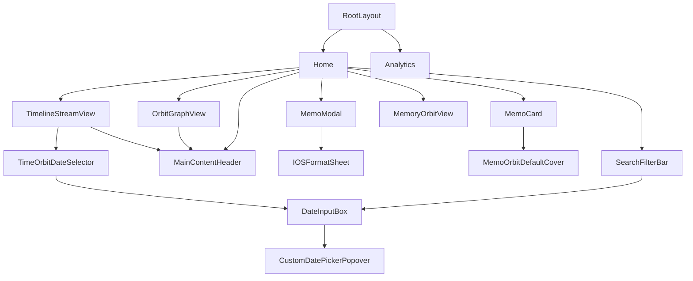
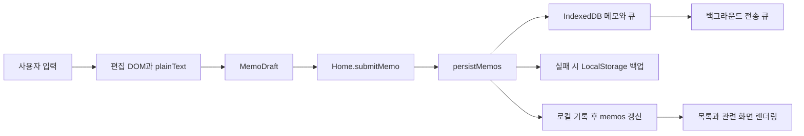

# MemoOrbit 프로젝트 구조와 핵심 코드 안내서

이 문서는 2026-09-09의 실제 소스 코드를 기준으로 작성했다. 구현 예정인 기능은 현재 동작과 구분한다. 요구사항과 완료 여부는 [PRD.md](PRD.md), 개발 규칙은 [AGENTS.md](AGENTS.md), 저장 큐의 서버 계약은 [docs/sync-and-orbit.md](docs/sync-and-orbit.md)를 함께 참고한다.

코드 발췌와 경계 사례를 따라 깊이 학습하려면 [전체 코드베이스 학습 가이드](FULL_CODEBASE_LEARNING_GUIDE.md)를 읽는다. 시스템·상태, 모바일 에디터·UI, 검색·물리 캔버스의 세 레이어로 학습 순서를 제공한다.

## 1. 먼저 알아둘 구조

MemoOrbit는 **Next.js App Router 화면 + React 브라우저 상태 + IndexedDB 로컬 저장 + Gemini 분석 API**로 구성된다. 브라우저가 메모를 먼저 저장하고, 별도 전송 큐가 연결된 서버로 보내도록 설계되어 있다. 저장 서버와 회원 인증은 아직 구현되지 않았다. Gemini API는 분석을 담당하며 메모를 보관하는 서버가 아니다.

프로젝트의 중앙 제어 지점은 [app/page.tsx](app/page.tsx)의 `Home`이다. 이 컴포넌트가 `memos` 원본 배열, 검색 조건, 현재 메뉴와 편집 대상을 보유한다. 하위 화면은 Props로 데이터를 받고 콜백으로 사용자 행동을 전달한다. 별도 전역 상태 라이브러리는 사용하지 않는다.

요청에 나온 `src/components/CreateMemoModal.tsx`는 존재하지 않는다. 실제 작성·편집 컴포넌트는 **[src/components/MemoModal.tsx](src/components/MemoModal.tsx)의 `MemoModal`**이다. API 라우트도 `src/`가 아니라 **`app/api/`**에 있다. 이름만 맞춘 중복 파일을 만들지 않고 실제 동작 파일을 기준으로 설명한다.

읽는 순서는 다음과 같다.

1. `types/memo.ts`에서 메모 한 건의 구조를 확인한다.
2. `app/page.tsx`의 `Home`, `submitMemo`, 초기 저장소 이펙트를 읽는다.
3. `MemoModal.tsx`에서 입력과 저장 요청의 연결을 따라간다.
4. `memoStorage.ts → storage/db.ts → syncQueue.ts` 순으로 저장과 전송을 구분한다.
5. `SearchFilterBar.tsx → filterMemos.ts`, `geminiClient.ts → app/api/`를 읽는다.

## 2. 전체 디렉터리 지도

```text
프로젝트 루트/
├─ app/
│  ├─ layout.tsx                 전역 HTML·폰트·메타데이터·방문 통계
│  ├─ page.tsx                   Home: 화면·메모 상태와 저장 요청의 중심
│  ├─ globals.css                공통 테마·리치 에디터·스크롤 스타일
│  ├─ favicon.ico                사이트 아이콘
│  └─ api/
│     ├─ gemini/route.ts         태그·한 줄 분석
│     ├─ tags/recommend/route.ts 태그 전용 추천
│     ├─ links/recommend/route.ts 메모 묶음의 관계 분석
│     └─ memos/link/route.ts     저장한 한 메모의 관계 분석
├─ src/
│  ├─ components/
│  │  ├─ MemoModal.tsx
│  │  ├─ iOSFormatSheet.tsx
│  │  ├─ MemoCard.tsx
│  │  ├─ MemoOrbitDefaultCover.tsx
│  │  ├─ SearchFilterBar.tsx
│  │  ├─ MainContentHeader.tsx
│  │  ├─ OrbitGraphView.tsx
│  │  ├─ TimelineStreamView.tsx
│  │  ├─ TimeOrbitDateSelector.tsx
│  │  ├─ MemoryOrbitView.tsx
│  │  ├─ DateInputBox.tsx
│  │  ├─ CustomDatePickerPopover.tsx
│  │  └─ ResponsiveDatePicker.tsx
│  ├─ hooks/
│  │  ├─ useVisualViewport.ts
│  │  ├─ useKeyboardFormatSheet.ts
│  │  └─ usePageScrollLock.ts
│  ├─ lib/
│  │  ├─ filterMemos.ts
│  │  ├─ geminiClient.ts
│  │  ├─ textAnalysis.ts
│  │  ├─ editorSelection.ts
│  │  ├─ editorLists.ts
│  │  ├─ editorChecklist.ts
│  │  ├─ memoStorage.ts
│  │  ├─ syncQueue.ts
│  │  ├─ groupMemosByTime.ts
│  │  ├─ orbitClustering.ts
│  │  ├─ orbitCanvas.ts
│  │  └─ storage/db.ts
│  ├─ utils/
│  │  ├─ selectRepresentativeImage.ts
│  │  ├─ groupMemosByDate.ts
│  │  └─ exportMemoryImage.ts
│  ├─ data/initialMemos.ts
│  └─ types/gemini.ts
├─ types/memo.ts                 앱 공통 메모 타입
├─ public/                      정적 배포 이미지 등
├─ tests/                       Node·JSDOM·가상 IndexedDB 자동 검증
├─ docs/sync-and-orbit.md        로컬 저장과 서버 계약의 보조 설명
├─ PRD.md                       제품 명세·구현 체크리스트
├─ AGENTS.md                    개발 규칙
└─ PROJECT_STRUCTURE.md         이 안내서
```

## 3. 진입점·설정·데이터 타입

| 파일 | 역할과 연결 |
| --- | --- |
| [app/layout.tsx](app/layout.tsx) | `RootLayout`이 모든 페이지의 `children`을 감싼다. 한국어 문서, Geist 폰트, 제목·설명, 전역 CSS를 설정하고 `<Analytics />`를 배치한다. 현재 Speed Insights 컴포넌트는 없다. |
| [app/page.tsx](app/page.tsx) | `Home`이 저장소를 불러와 `memos`를 초기화한다. 메뉴 전환은 별도 URL 이동이 아닌 `activeSection` 조건부 렌더링이다. 작성·수정·삭제·고정·검색·AI 링크 병합을 연결한다. |
| [app/globals.css](app/globals.css) | Tailwind 기반 공통 색상과 스크롤바, `.rich-editor`의 문단·표·체크리스트·서식 스타일을 정의한다. 에디터 DOM 클래스가 바뀌면 함께 확인한다. |
| [types/memo.ts](types/memo.ts) | `Memo`, `MemoLink`, `MemoImageAttachment`, `SyncQueueEntry` 계약이다. 화면·저장소·AI 요청이 같은 필드 이름을 공유한다. |
| [src/types/gemini.ts](src/types/gemini.ts) | `GeminiAnalysis`, `GeminiAnalysisPurpose`, `GeminiMemoLink`를 정의한다. 메모 전체 타입과 분석 응답 타입을 구분한다. |
| [src/data/initialMemos.ts](src/data/initialMemos.ts) | 10개 주제의 목업 200개를 만든다. 로컬 이미지, 서로 다른 본문 길이, 날짜 분포, 초기 고정 3개를 포함한다. 실제 저장 데이터가 있는 기기에 새로 주입하는 목록은 아니다. |
| [package.json](package.json), [package-lock.json](package-lock.json) | Next.js 16.3.3, React 19.2.8, TypeScript, Tailwind, `idb`, Google SDK, Vercel Analytics 등의 의존성과 설치 버전을 관리한다. |
| [tsconfig.json](tsconfig.json) | Strict Mode와 `@/* → ./*` 별칭을 설정한다. `@/src/...`는 루트의 `src`, `@/types/...`는 루트의 `types`다. |
| [next.config.ts](next.config.ts) | 현재 별도 옵션 없는 Next.js 설정 진입점이다. |
| [eslint.config.mjs](eslint.config.mjs), [postcss.config.mjs](postcss.config.mjs) | 코드 검사와 CSS 처리 설정이다. |
| [next-env.d.ts](next-env.d.ts) | Next.js의 생성 타입 참조 파일이다. 일반 기능 구현 위치로 사용하지 않는다. |

`node_modules/`는 의존성, `.next/`는 생성 결과다. 앱 기능 수정은 위 소스에서 수행한다. `public/`의 파일은 `/memo-images/...`처럼 루트 URL로 사용한다.

### 메모와 전송 항목의 차이

| 필드 | 의미·주요 소비자 |
| --- | --- |
| `Memo.id` | 메모의 고유 식별자. 카드 key, DB 기본키, 링크 대상에 사용한다. |
| `title`, `content`, `richContent` | 제목·일반 본문·HTML 본문. 편집기는 HTML을 복원하고 카드·검색·분석은 각 용도에 맞는 필드를 읽는다. |
| `createdAt`, `updatedAt` | 작성일과 수정일. 검색 기간은 작성일, 기본 정렬과 메인 날짜 그룹은 수정일을 사용한다. |
| `tags`, `isPinned` | 태그 검색과 고정 목록에 사용한다. |
| `images`, `imageUrl` | 전체 첨부 목록과 대표 사진. 대표를 바꿔도 전체 첨부 목록을 대체하지 않는다. |
| `links` | `targetId`, `weight`, 선택적 `reason`으로 연결한다. `undefined`는 재분석이 필요한 상태, 빈 배열은 분석했지만 연결이 없는 상태로 활용된다. |
| `syncStatus`, `syncRevision` | 전송 대기·실패·완료 배지와 해당 수정본의 식별자다. HTTP 성공만으로 최신 편집본을 동기화 완료로 만들지 않는다. |
| `userId` | 선택 필드만 있으며 현재 회원 인증·소유권 검사를 구현했다는 의미는 아니다. |
| `SyncQueueEntry` | 같은 메모 ID의 최신 `upsert` 또는 `delete` 작업, revision, 재시도 횟수·시각을 기록한다. 전체 편집 이력을 쌓는 로그는 아니다. |

## 4. 컴포넌트별 역할과 입출력

| 파일·컴포넌트 | 입력 → 내부 책임 → 출력·의존 관계 |
| --- | --- |
| [MemoModal.tsx](src/components/MemoModal.tsx) · `MemoModal` | `editingMemo`, `isOpen`, `isSaving` → 단일 contentEditable 편집, 선택·서식·표·첨부·태그 관리 → `onSubmit(MemoDraft)` 또는 `onClose()`. 세 모바일 훅, 세 편집 유틸리티, 태그 요청, 대표 이미지 계산을 사용한다. 자체적으로 DB를 저장하지 않는다. |
| [iOSFormatSheet.tsx](src/components/iOSFormatSheet.tsx) · `IOSFormatSheet` | `activeFormat`, `disabled` → 문단 스타일·글자 서식·목록/들여쓰기의 3행 표시 → `onKeepSelection`, `onFormat(command, value)`. 실제 편집 DOM은 부모가 관리한다. 파일명과 export의 대소문자가 다르므로 import를 확인한다. |
| [MemoCard.tsx](src/components/MemoCard.tsx) · `MemoCard` | `memo`, 보기 모드, 부모의 열린 스와이프 ID → 텍스트/갤러리 카드, 저장 배지, 스와이프·메뉴 → 수정·삭제·고정 콜백. 오른쪽 고정 액션은 부분 열림과 카드 너비 80% 풀 스와이프를 구분한다. |
| [MemoOrbitDefaultCover.tsx](src/components/MemoOrbitDefaultCover.tsx) · `MemoOrbitDefaultCover` | 표시 옵션 → 사진 없는 갤러리 카드용 궤도 그래픽. 데이터 저장이나 이미지 생성 API를 호출하지 않는다. `MemoCard`에서 사용한다. |
| [SearchFilterBar.tsx](src/components/SearchFilterBar.tsx) · `SearchFilterBar` | `options`, `availableTags` → 검색창 로컬 `keyword`, 필터 패널과 칩 → `onOptionsChange`로 부모 조건 갱신. 검색어는 300ms 후, 상세 조건은 즉시 전달한다. 날짜는 `DateInputBox`, 모바일 배경 잠금은 `usePageScrollLock`을 사용한다. |
| [MainContentHeader.tsx](src/components/MainContentHeader.tsx) · `MainContentHeader` | 제목·설명·개수·액션 → 공통 제목 영역. IntersectionObserver로 노출 여부를 부모에 알린다. 현재 Home은 이 알림의 setter를 연결하지만 해당 상태값을 읽어 상단 브랜드를 전환하지는 않는다. |
| [OrbitGraphView.tsx](src/components/OrbitGraphView.tsx) · `OrbitGraphView` | 필터된 `memos` → 메모별 캔버스 노드·제스처·미리보기 → `onOpenMemo`, `onLinksAnalyzed`. `orbitClustering` 계산과 `orbitCanvas` 그리기를 분리한다. 이름과 달리 현재는 예전 태그별 행성 목록이 아닌 메모별 성운이다. |
| [TimelineStreamView.tsx](src/components/TimelineStreamView.tsx) · `TimelineStreamView` | Home의 전체 `memos` → 자체 날짜 범위, 주제·질문·미완료 체크 분석 → 총평·재발견 후보와 `onOpenMemo`. `TimeOrbitDateSelector`, `groupMemosByTime`, `textAnalysis`, Gemini 분석을 사용한다. 메인 검색 조건과 별도 범위다. |
| [TimeOrbitDateSelector.tsx](src/components/TimeOrbitDateSelector.tsx) · `TimeOrbitDateSelector` | 부모의 시작·종료일 → 1주일·1개월·3개월·1년·전체·직접 입력 프리셋 → `onRangeChange`로 두 날짜를 함께 전달한다. 두 `DateInputBox`를 사용한다. |
| [MemoryOrbitView.tsx](src/components/MemoryOrbitView.tsx) · `MemoryOrbitView` | Home이 골라 준 1년 전·100일 전 후보 → 갤러리의 추억 카드, 숨김 상태, 내보내기 확인 → `onOpenMemo` 또는 `exportMemoryImage`. 숨긴 ID는 별도 LocalStorage 키로 기억한다. 시간 궤도 분석 화면과 다른 기능이다. |
| [DateInputBox.tsx](src/components/DateInputBox.tsx) · `DateInputBox` | 날짜 문자열·활성 여부·정렬 옵션 → 날짜 표시/초기화와 팝오버 열림 → `onChange`. 실제 달력 UI는 `CustomDatePickerPopover`이며 바깥 클릭·Escape로 닫는다. |
| [CustomDatePickerPopover.tsx](src/components/CustomDatePickerPopover.tsx) · `CustomDatePickerPopover` | 선택 날짜 → 표시 월·일요일 시작 7열 달력 → 선택한 `YYYY-MM-DD`를 부모에 전달한다. 날짜 범위 전체의 의미는 상위 화면이 결정한다. |
| [ResponsiveDatePicker.tsx](src/components/ResponsiveDatePicker.tsx) · `ResponsiveDatePicker` | 직접 날짜 입력 검증·포털 달력·스크롤 잠금을 포함한 별도 구현. **현재 다른 앱 소스에서 import되지 않는다.** 활성 검색·시간 선택 UI를 수정하려면 먼저 `DateInputBox`를 확인한다. |

### 주요 컴포넌트 의존 관계

실선은 주요 컴포넌트 사용 관계다. 목록은 모든 JSX 요소가 아니라 재사용 컴포넌트 연결을 나타낸다.



## 5. 훅·로직·유틸리티 전체 목록

### 브라우저 수명과 모바일 화면

| 파일 | 역할과 데이터 흐름 |
| --- | --- |
| [useVisualViewport.ts](src/hooks/useVisualViewport.ts) | `active` → VisualViewport 또는 창의 resize 구독 → 프레임당 최신 높이 측정 → `{ height, offsetTop }`. 높이는 정수화하고 offsetTop은 0을 유지한다. scroll은 구독하지 않으며 키보드 열림 boolean을 제공하지 않는다. |
| [useKeyboardFormatSheet.ts](src/hooks/useKeyboardFormatSheet.ts) | `open()` → waiting → 가시 높이 복원·안정화 확인 → format. `close()`는 editor로 돌아가며 이펙트 정리로 대기 예약을 취소한다. API 미지원 환경은 지연 후 표시한다. |
| [usePageScrollLock.ts](src/hooks/usePageScrollLock.ts) | 잠금 요청 → 최초 위치·스타일 보관 → html/body 잠금과 문서 원점 보정 → 마지막 잠금 해제 때 복원. 모듈의 참조 횟수로 중첩 팝업을 처리한다. 이 훅은 scroll을 구독하지만 편집 래퍼의 높이·offsetTop을 계산하지 않는다. |

### 저장·검색·AI·편집·캔버스 로직

| 파일 | 역할과 호출 관계 |
| --- | --- |
| [filterMemos.ts](src/lib/filterMemos.ts) | Home의 배열과 `MemoFilterOptions`를 받아 교차 필터와 정렬 결과를 새 배열로 반환한다. React·DB·API에 의존하지 않지만 기간 계산에는 현재 시각을 읽는다. |
| [geminiClient.ts](src/lib/geminiClient.ts) | 브라우저의 네 가지 분석 요청을 공통 함수로 모은다. 요청 바디를 조립하고 응답을 검사하며 오류는 호출 화면이 처리한다. 서버 API 키를 읽지 않는다. |
| [textAnalysis.ts](src/lib/textAnalysis.ts) | `extractDynamicKeywords`가 본문의 반복 빈도·등장 위치·문장 분포로 핵심어를 계산한다. 모달 추천의 실패 대체와 시간 궤도 로컬 분석에 사용한다. 신경망이나 서버 호출이 아닌 브라우저 문자열 분석이다. |
| [editorSelection.ts](src/lib/editorSelection.ts) | 에디터 내부 Range 검증·보관·복원, 선택 글자의 서식 읽기·변경을 담당한다. 문자 위치 책갈피와 임시 커서 문자를 사용하고 새 Range를 모달에 돌려준다. |
| [editorLists.ts](src/lib/editorLists.ts) | 선택 문단의 불릿·번호 목록, 들여쓰기·내어쓰기를 처리한다. `editorSelection`과 연결하여 포커스 없이도 저장된 선택을 기준으로 편집한다. |
| [editorChecklist.ts](src/lib/editorChecklist.ts) | 체크박스와 글자 영역을 나눠 만들고 Enter로 항목을 이어 만든다. 빈 항목에서는 일반 문단으로 나간다. 결과 Range를 모달에 전달한다. |
| [memoStorage.ts](src/lib/memoStorage.ts) | Home의 저장소 입구. `hydrateMemoStorage`는 초기 복구·마이그레이션·목업 준비, `persistMemos`는 전체 목록 쓰기를 Promise 체인으로 직렬화한다. 실패 시 LocalStorage 백업을 쓰며 저장 후 큐 알림을 보낸다. |
| [storage/db.ts](src/lib/storage/db.ts) | `idb`로 `MemoOrbitDB` 버전 2를 연다. `memos`, `syncQueue`, `settings` 저장소와 마이그레이션, 메모·전송 항목의 트랜잭션 기록을 담당한다. `memoContentKey`는 배지 변경과 실제 내용 변경을 구분한다. |
| [syncQueue.ts](src/lib/syncQueue.ts) | DB의 대기 작업을 순서대로 보내고 수정본이 일치하는 결과만 반영한다. `createSyncTransport`, `drainSyncQueue`, `settleSyncEntry`, `startSyncQueue`로 전송·확정·수명을 나눈다. 서버가 미설정이면 전송하지 않는다. |
| [groupMemosByTime.ts](src/lib/groupMemosByTime.ts) | 작성일 기준 오늘·어제·2~7일·8~30일·이전 기록으로 나눈다. 빈 구간도 포함한 다섯 배열을 반환한다. `TimelineStreamView`가 시간 분포 설명에 사용한다. |
| [orbitClustering.ts](src/lib/orbitClustering.ts) | Memo 링크 → 노드/간선 초기 배치 → 물리 계산 한 단계 → 새 좌표. 0.75 이상 연결로 그룹을 만들고, `zoomOrbitAt`은 확대 중점 아래 좌표를 보존한다. |
| [orbitCanvas.ts](src/lib/orbitCanvas.ts) | 계산된 `OrbitLayout`과 확대·이동 값을 Canvas에 그린다. 강한 선부터 노드당 최대 네 개를 표시한다. 물리 상태나 메모 내용의 소유자는 아니다. |

### 보조 유틸리티

| 파일 | 역할과 호출 관계 |
| --- | --- |
| [selectRepresentativeImage.ts](src/utils/selectRepresentativeImage.ts) | `MemoModal`의 본문·태그·첨부 이름으로 대표 URL을 고른다. 파일명에 태그가 있으면 3점, 본문 단어는 1점이며 동점·전부 미일치면 앞선 사진을 유지한다. 이미지 픽셀을 AI로 분석하지 않는다. |
| [groupMemosByDate.ts](src/utils/groupMemosByDate.ts) | 작성일 기준 날짜 그룹을 만들고 비어 있는 그룹을 제거하는 유틸리티. **현재 다른 앱 소스에서 import되지 않는다.** 메인 목록은 Home 내부의 `groupLabel(updatedAt)`과 reduce를 사용한다. |
| [exportMemoryImage.ts](src/utils/exportMemoryImage.ts) | `MemoryOrbitView`가 전달한 메모로 400×500 Canvas 이미지를 합성하고 PNG 다운로드를 실행한다. 사진 로드·줄바꿈·Blob 변환을 담당하며 메모 DB는 변경하지 않는다. |

## 6. API 라우트와 브라우저 함수의 연결

모든 현재 API는 `POST`이며 Node.js 런타임에서 Google SDK를 호출한다. 아래 모델명은 소스의 상수값이며 외부 서비스에서 현재 사용 가능함을 검증한 목록은 아니다. 실패 시 처리는 화면마다 다르다.

| 서버 파일·URL | 호출자·입력 | 성공 응답·검증·실패 처리 |
| --- | --- | --- |
| [app/api/tags/recommend/route.ts](app/api/tags/recommend/route.ts) · `/api/tags/recommend` | `requestRecommendedTags(text, signal)` ← 모달·Home 검색. `{ text }`. 모델 `gemini-1.5-flash`. | `{ tags: string[] }`, 최대 5개. 모달은 실패하면 로컬 핵심어로 대체하고 Home 검색은 일반 문자열 결과를 유지한다. |
| [app/api/gemini/route.ts](app/api/gemini/route.ts) · `/api/gemini` | `requestGeminiAnalysis(text, purpose, signal)` ← 시간 궤도. `{ text, purpose }`, purpose는 tags 또는 timeline. 모델 `gemini-2.5-flash`. | `{ tags, comment }`. 태그·문구 모양을 검증한다. 오류 응답의 details는 `GeminiApiError`로 전달되고 시간 궤도는 로컬 총평을 표시한다. |
| [app/api/links/recommend/route.ts](app/api/links/recommend/route.ts) · `/api/links/recommend` | `requestMemoLinks(memos, signal)` ← 성운 화면. `{ memos }`에 ID·제목·축약 본문·태그를 담는다. 모델 `gemini-1.5-flash`. | `{ links: GeminiMemoLink[] }`. 0~1 점수와 유효 ID를 검사하고 자기 연결·중복 쌍을 제거한다. 실패하면 저장된 링크를 유지한다. |
| [app/api/memos/link/route.ts](app/api/memos/link/route.ts) · `/api/memos/link` | `requestLinksForMemo(memo, existingMemos)` ← 저장 직후 Home. `{ memo, existingMemos }`. 모델 `gemini-1.5-flash`. | 포장 객체 없는 `MemoLink[]`. 서버는 기존 후보를 최대 200개로 제한하고 0.75 이상 링크를 정규화한다. 실패해도 앞서 완료한 로컬 저장을 취소하지 않는다. |

메모 묶음 분석은 한 요청에 최대 500개를 보내며, 클라이언트는 초과 시 450개 간격으로 겹치는 묶음을 보낸다. 모든 메모가 분석 대상에는 들어가지만 모든 쌍을 전부 비교하는 알고리즘은 아니다. 약한 관계도 반환할 수 있으나 그룹 구성과 화면의 강한 연결선에는 0.75 기준을 사용한다.

`GEMINI_API_KEY`는 서버에서만 읽는다. `NEXT_PUBLIC_MEMO_SYNC_ENDPOINT`는 브라우저에서 사용할 동일 출처의 저장 서버 주소이며 비밀키가 아니다. `/api/memos/sync`는 연결 예시일 뿐 현재 존재하는 라우트가 아니다. 환경변수의 실제 비밀값은 이 문서에 기록하지 않는다.

## 7. 주요 데이터 흐름을 단계별로 따라가기

### 7.1 앱을 처음 열었을 때

1. `Home`이 초기 `memos`로 목업을 준비한 뒤 저장소 초기화 이펙트를 실행한다.
2. `hydrateMemoStorage(initialMemos)`가 장애 백업을 우선 확인한다. 백업이 있으면 DB로 복구한 뒤 백업 키를 지운다.
3. 백업이 없으면 IndexedDB와 이전 `memoorbit-memos` 데이터를 읽는다. 이전 데이터는 성공적으로 옮긴 다음 제거한다.
4. `settings.initialized`가 참이고 저장소가 비었으면 사용자가 모두 삭제한 것으로 보고 빈 배열을 유지한다. 최초 사용일 때만 목업을 저장한다.
5. `setMemos(storedMemos)`와 `setHasHydratedStorage(true)`가 화면을 실제 저장 데이터와 연결한다. 그 후 큐 구독을 시작한다.

### 7.2 메모 작성 → 로컬 저장 → 목록 표시

1. 작성 버튼이 `editingMemo=null`, `isEditorOpen=true`를 설정한다. 카드 수정은 `openMemo(memo)`가 편집 대상을 지정한다.
2. `MemoModal.mountEditor`가 초기 HTML을 한 번 넣는다. 타이핑은 실제 DOM을 바꾸고 `onInput`이 `plainText`를 갱신한다. HTML을 매번 State에서 덮어쓰지 않아 선택 범위를 보존한다.
3. 저장 버튼은 `submit → saveCurrentMemo`, 닫기는 `closeEditor → saveCurrentMemo`로 이어진다. 첫 줄과 나머지를 나눠 `MemoDraft`를 만든다.
4. 부모 `Home.submitMemo`가 ID·날짜·태그 배열·pending 상태를 붙이고 `persistMemos` 완료를 기다린다.
5. `persistMemos → replaceAllMemos`가 실제 내용이 달라진 메모와 최신 전송 항목을 하나의 트랜잭션에 기록한다. IndexedDB 실패 시 LocalStorage 백업을 시도한다. 둘 다 실패하면 편집기를 유지한다.
6. 로컬 기록 후 Home이 새 배열로 `memos`를 갱신하고 모달을 닫는다. 이후 카드·검색·성운은 새 상태를 받는다. 저장 직후 AI 연결은 비동기로 추가 처리하며 로컬 저장을 기다리게 하지 않는다.



### 7.3 큐 재시도 → 배지 갱신

1. `startSyncQueue`가 시작 직후, 온라인 전환, 새 저장 이벤트, 5초 주기마다 실행을 요청한다.
2. `running`은 중복 실행을 막고 `rerun`은 처리 중 들어온 새 요청을 기억한다. Web Locks 지원 환경에서는 같은 출처의 탭 사이도 직렬화한다.
3. `drainSyncQueue`가 재시도 시각이 된 가장 오래된 한 항목을 보낸다. 장애 백업이 남아 있으면 예전 DB 전송을 멈춘다.
4. 전송은 20초 제한과 취소 신호를 사용한다. 실패는 지수 지연 후 재시도하고, 종료·오프라인이면 큐를 보존한다.
5. `settleSyncEntry`는 현재 큐의 revision과 전송한 revision이 같은지 확인한다. 같을 때만 큐 제거·배지 변경을 확정한다. 뒤늦은 이전 수정본 응답은 무시한다.
6. `publish → onChange`가 DB 배열을 Home에 알린다. Home은 `memoContentKey`까지 같은 항목의 상태 정보만 합쳐 새 편집을 덮어쓰지 않는다.

`pending`은 로컬 기록 후 전송 대기, `failed`는 전송 실패, `synced`는 같은 수정본의 서버 확인을 뜻한다. **서버가 미설정인 현재 구조에서는 pending이 정상일 수 있다.** 서버가 `Idempotency-Key`에 대한 중복 방지와 실제 저장을 구현해야 원격 저장 보장이 성립한다.

### 7.4 검색 입력 → 결과와 성운

1. `SearchFilterBar.keyword`가 키 입력을 즉시 표시한다.
2. 300ms 후 `onOptionsChange`가 Home의 `filterOptions`를 갱신한다. 현재 검색 입력은 의미 검색을 켜고 이전 점수를 비운다.
3. Home은 확정 검색어를 태그 추천 API로 확장한다. 확장어가 제목·본문·태그에 얼마나 포함되는지 계산해 `semanticScores`를 만든다. 벡터 DB 검색은 아니다.
4. `filterMemos`가 문자열 또는 양수 AI 점수, 선택 태그 중 하나 이상, 사진·표·고정·작성일 범위를 교차 검사한다.
5. 결과는 AI 점수 우선, 동점이면 고정·최신 수정순이다. 일반 검색은 고정·최신 수정순이다. Home의 `filteredMemos`는 카드 목록과 성운에 함께 전달된다.
6. 메인 목록은 이 결과를 고정 그룹과 수정일별 그룹으로 나눠 렌더링한다. 따라서 최종 화면은 하나의 평평한 점수 목록이 아니다. 시간 궤도는 전체 memos를 받아 자체 기간 조건을 사용한다.

예를 들어 태그 여행·독서와 사진 조건을 선택하면 **여행 또는 독서 태그가 있고 사진도 있는 메모**가 남는다. 여러 종류의 조건은 AND, 선택 태그끼리는 OR다. boolean 옵션의 `undefined`는 검사하지 않음이고 `false`는 해당 속성이 없는 메모만 선택한다.

### 7.5 모바일 키보드·서식·표 다음 줄

1. `useVisualViewport`의 높이가 모달 CSS 변수로 이어져 내부 편집 래퍼 높이를 바꾼다. header와 toolbar는 shrink-0, 본문은 독립 세로 스크롤이다.
2. 가가 버튼의 `keepSelection`·`rememberSelection`이 선택 범위를 보관한다. `toggleFormatLayer`는 입력을 blur하고 훅을 waiting으로 바꾼다.
3. `useKeyboardFormatSheet`가 높이 복원과 안정화를 확인하면 3행 `IOSFormatSheet`를 표시한다. 서식 명령은 보관한 선택에 적용하며 키보드를 다시 열지 않는다.
4. 본문 터치는 `resumeEditor`로 편집을 즉시 켜고 포커스를 요청한다. 이 흐름은 `usePageScrollLock`의 배경 잠금과 별개다.
5. `insertTable`은 표와 빈 문단을 함께 만들고 첫 셀로 이동한다. 표 안에서 다시 눌러도 바깥 독립 표를 만들며 기존 표 사이 입력 줄도 남긴다.
6. 본문 하단 `pb-60`은 240px 터치 여백이다. 여백 클릭은 `handleEditorAreaClick → focusEditorEnd`로 마지막 문단에 커서를 놓고 본문 스크롤만 조정한다. CSS 공간과 실제 입력 문단은 각각 필요하다.

### 7.6 AI 관계·시간 분석·추억 내보내기

성운 화면은 미분석 메모가 있으면 `requestMemoLinks`를 호출한다. Home의 `applyAnalyzedLinks`가 양방향 링크를 `memos`에 합치고 저장 이펙트가 이를 기록한다. `createOrbitLayout → stepOrbitLayout → drawOrbitCanvas`가 좌표 계산과 시각화를 나눠 처리한다. 화면은 180단계 계산 후에는 제스처·크기 변경 등 다시 그릴 이유가 있을 때 갱신한다.

시간 궤도는 선택 기간의 주제·질문·미완료 항목을 로컬에서 계산한 뒤 Gemini 총평을 요청한다. 실패해도 로컬 총평과 요약을 보여 준다. 갤러리의 `MemoryOrbitView`는 별도로 1년 전·100일 전 후보를 받아 숨김 목록을 적용하고, 사용자가 확인하면 Canvas PNG를 다운로드한다.

## 8. 핵심 네 파일을 수정하기 전에 볼 지점

| 파일 | 반드시 구분할 값·원리 | 잘못 바꾸면 생기는 문제 |
| --- | --- | --- |
| `MemoModal.tsx` | DOM HTML, `plainText`, `savedRange`, `activeFormat`, 부모의 저장 완료 책임 | State 변경마다 HTML을 재주입하면 커서·부분 선택을 잃는다. onSubmit 호출 직후 강제로 닫으면 저장 실패 시 편집 내용을 잃을 수 있다. |
| `useVisualViewport.ts` | 실제 높이 측정, 프레임 예약, offsetTop=0, 구독 정리 | scroll마다 높이·위치를 덮어쓰면 키보드의 위치 보정과 충돌할 수 있다. 시트 표시 판단을 이 훅의 반환값으로 오해하지 않는다. |
| `filterMemos.ts` | 태그 OR·조건 AND, 작성일 필터·수정일 정렬, 현재 날짜 의존 | 원본 배열을 정렬하거나 false를 미선택으로 해석하면 저장 순서 또는 검색 의미가 달라진다. |
| `syncQueue.ts` | 전송과 로컬 저장의 분리, revision 비교, 종료 신호, rerun | 이전 응답이 새 편집의 큐를 지우거나 서버 미연결을 synced로 표시할 수 있다. |

주석은 각 함수의 입력 출처, 상태 변경의 소비자, 이펙트 의존성과 정리 시점, 잘못 구현하기 쉬운 이유를 설명한다. `filterMemos.ts`와 `syncQueue.ts`에는 React State·이펙트가 없으므로 존재하지 않는 훅을 추가하지 않는다.

## 9. 기능별 수정 위치

| 바꾸려는 기능 | 먼저 볼 파일 | 함께 확인할 연결 |
| --- | --- | --- |
| 작성 버튼·저장 완료·목록 갱신 | `app/page.tsx` | `MemoModal`의 `MemoDraft`, `persistMemos` |
| 에디터 표·선택·체크리스트 | `MemoModal.tsx` | `editorSelection.ts`, `editorChecklist.ts`, `editorLists.ts`, `app/globals.css` |
| 키보드 도킹·서식 시트 | `useVisualViewport.ts`, `useKeyboardFormatSheet.ts` | 모달 레이아웃, `usePageScrollLock.ts`, `iOSFormatSheet.tsx` |
| 검색 UI | `SearchFilterBar.tsx` | Home의 `filterOptions`, `filterMemos.ts` |
| 검색 결과·정렬·날짜 기준 | `filterMemos.ts` | Home의 점수 계산·그룹 나누기 |
| 달력 표시 | `DateInputBox.tsx`, `CustomDatePickerPopover.tsx` | `TimeOrbitDateSelector.tsx`, 검색 필터 |
| 저장 형식·마이그레이션 | `types/memo.ts`, `storage/db.ts` | `memoStorage.ts`, `syncQueue.ts`, 기존 데이터 호환성 |
| 저장 서버 연결 | `syncQueue.ts` | 별도로 구현할 인증·DB 서버와 `docs/sync-and-orbit.md` 계약 |
| AI 태그·관계·총평 | `geminiClient.ts`, 대응 `app/api/.../route.ts` | 각 화면의 실패 대체와 응답 검증 |
| 성운 모양·성능·제스처 | `OrbitGraphView.tsx` | `orbitClustering.ts`, `orbitCanvas.ts` |
| 추억 후보·다운로드 | Home의 `findMemoryCandidates`, `MemoryOrbitView.tsx` | `exportMemoryImage.ts` |

## 10. 현재 구현 범위와 확인할 한계

- `ResponsiveDatePicker.tsx`, `groupMemosByDate.ts`는 파일은 있지만 현재 앱 import 경로에 연결되지 않는다. 삭제가 필요하다는 판단과는 별개이며, 활성 기능을 고치려면 실제 호출자를 먼저 확인한다.
- 원격 메모 저장·회원 인증은 미구현이다. AI 분석 성공, 인터넷 연결 표시, 로컬 저장 성공은 원격 백업 성공과 다르다.
- 저장 함수는 일반 글자가 비어 있으면 저장하지 않는다. 따라서 빈 표 또는 첨부만 있는 메모 저장은 현재 지원 범위와 별도로 검토해야 한다.
- `sanitizeEditorHtml`은 일부 태그·이벤트 속성을 제거하는 제한된 처리다. 저장 HTML의 완전한 안전성을 보장하는 전용 정화기로 문서화하지 않는다.
- iPhone 실기기의 키보드 애니메이션·선택 핸들·터치 스크롤은 자동 DOM 검증과 다르다. PRD의 실기기 검수 항목을 확인한다.
- 이 문서와 주석 보강은 동작 수정 작업이 아니다. 위 한계를 발견했다고 실행 로직을 함께 변경하지 않는다.

## 11. 검증 방법

| 파일·명령 | 확인 범위 |
| --- | --- |
| [tests/memo-modal.test.mjs](tests/memo-modal.test.mjs) | React/JSDOM에서 태그·서식·키보드 높이 모사, DOM 선택 보존, 연속 표와 하단 입력 동작을 검증한다. 실제 모바일 렌더러 검증은 아니다. |
| [tests/editor-selection.test.mjs](tests/editor-selection.test.mjs) | 부분 선택·서식 토글·선택 보존과 목록 편집을 검증한다. |
| [tests/editor-checklist.test.mjs](tests/editor-checklist.test.mjs) | 체크리스트 삽입·Enter·빈 항목 종료·본문 보존을 검증한다. |
| [tests/local-first-orbit.test.mjs](tests/local-first-orbit.test.mjs) | 가상 IndexedDB와 테스트 전송기로 저장·재시도·충돌·마이그레이션을 검사하고 물리 좌표·확대 계산을 검증한다. |
| `npm test` | 위 기존 테스트 전체 실행. 실제 Gemini 서비스나 저장 서버 성공 검증을 의미하지 않는다. |
| `npx eslint .` | 코드 규칙과 미사용 항목 검사. |
| `npx tsc --noEmit` | TypeScript 타입 검사. |
| `npm run build` | Next.js 프로덕션 빌드. 기존 Google Fonts 다운로드 때문에 네트워크 접근이 필요할 수 있다. |

Windows PowerShell 실행 정책으로 npm.ps1이 막히면 동일 명령의 `npm.cmd`, `npx.cmd`를 사용한다. 문서·주석만 바꿀 때는 실제 파일 목록과 문서 링크를 대조하고, TypeScript 구문에서 주석을 제외한 결과가 변경 전과 같은지 확인하여 동작 변경이 섞이지 않았음을 검증한다.
